# assignment-1

used methods:
* filtering methods (GaussianBlur)
* thresholding, adaptive thresholding
* edge detection (Canny)
* morphological operations (diletation, erosion, closing, opening)
* contour analysis (findContours)
- - - -
## Bubbles
My main goal for this picture was to identify individual bubbles and analyze their area. The code for this task can be found in `bubbles.ipynb`.

### Attempt 1 - Canny
Initially, I loaded the image and converted it to grayscale.

```py
img = cv2.imread('data/pena.tif')
gray = cv2.cvtColor(img, cv2.COLOR_BGR2GRAY)
```

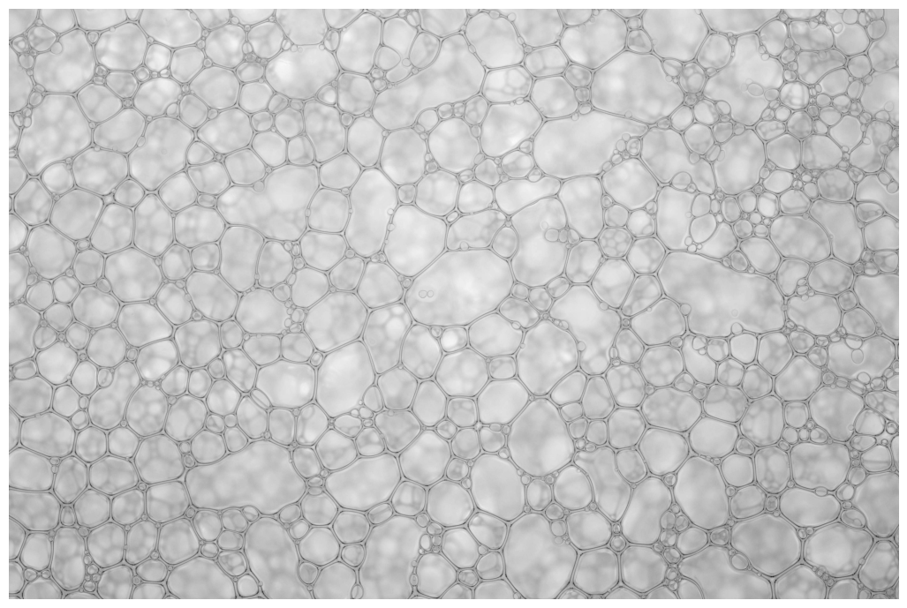

#### Filtering
Next, I used `GaussianBlur` in order to filter out the outlines of bubbles, which are located inside of the surface bubbles.

```py
filtered = cv2.GaussianBlur(gray, (5, 5), 1)
```

#### Binarization
For binarization of the input image, I used the **Canny edge detector**.

```py
edges = cv2.Canny(filtered, 20, 120)
```

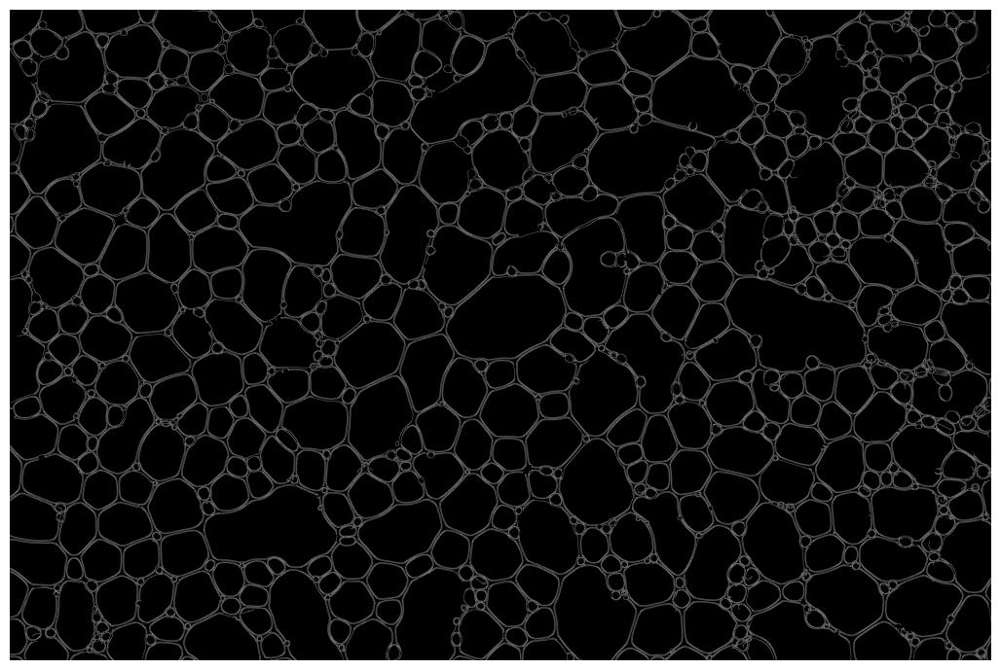

The output from this algorithm was further modified using morphological operations. As first operation, I used **dilation**, which enhanced the edges of individual bubbles.

```py
kernel = cv2.getStructuringElement(shape=cv2.MORPH_ELLIPSE, ksize=(11, 11))
edges = cv2.dilate(edges, kernel, iterations=1)
```

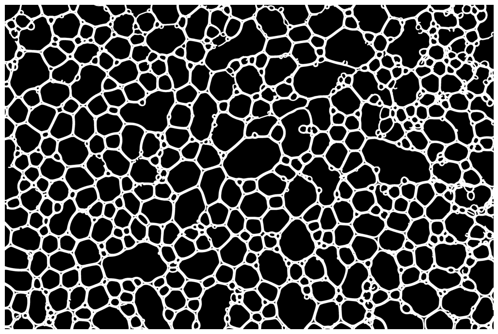

After dilatation, 'holes' remained in the edges between the bubbles. These holes, however, do not represent additional bubbles, so I decided to remove them using the **closing** operation.

```py
kernel = cv2.getStructuringElement(shape=cv2.MORPH_ELLIPSE, ksize=(11, 11))
edges = cv2.morphologyEx(edges, cv2.MORPH_CLOSE, kernel, iterations=1)
```

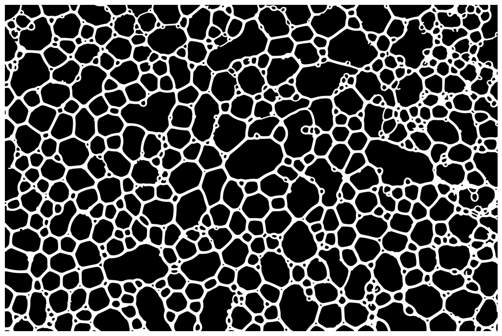

#### Contour Analysis
Before actually searching for contours in the created mask, it is necessary to first invert the mask using `cv2.bitwise_not(edges)`.

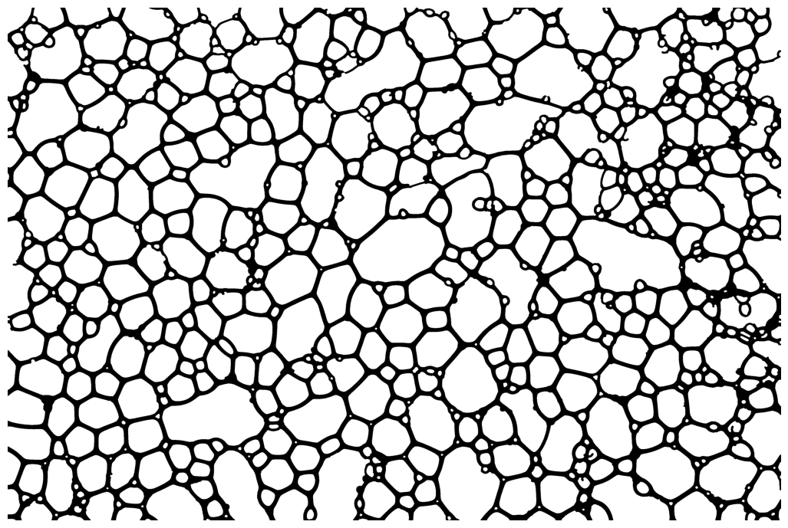

Without inverting, the method for finding contours did not work well and for example marked the edge of the image as one big contour, as can also be seen in the image below.

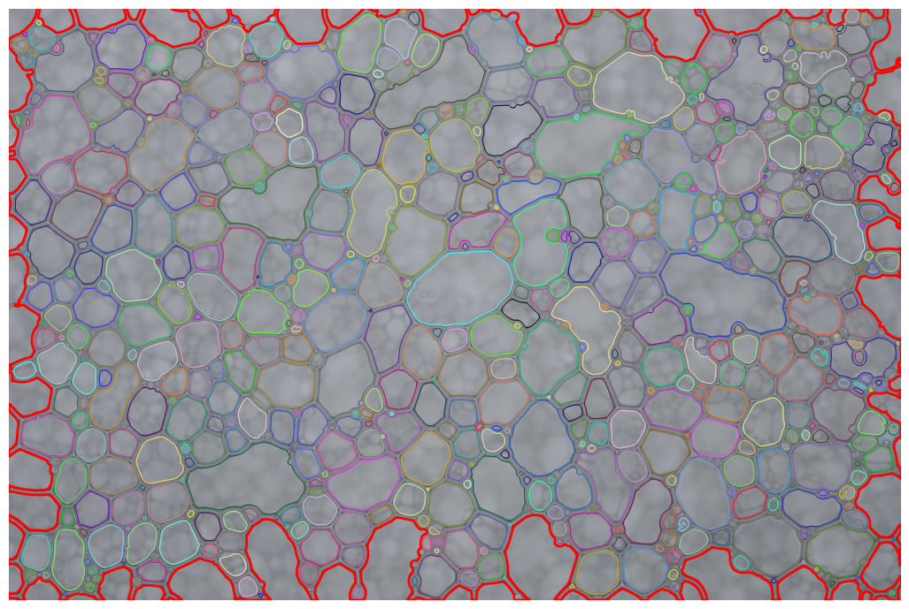

To find the contours, I used the `findContours` method with the `RETR_EXTERNAL` mode, which worked the best and did not mark the inner bubbles. Later, I iterated through the found contours, which I marked in the original image and also recorded their area.

At the end, I marked the largest contour and printed out: the number of bubbles, the average area and the area of ​​the largest bubble.
```py
contours, h = cv2.findContours(edges, cv2.RETR_EXTERNAL, cv2.CHAIN_APPROX_SIMPLE)
n = 0

areas = []
biggest = { 'area': -1 }
for i, c in enumerate(contours):
    area = cv2.contourArea(c)
    areas.append(area)

    if area > biggest['area']:
        biggest['area'] = area
        biggest['contour'] = i

    colour = (randrange(255), randrange(255), randrange(255))
    cv2.drawContours(segmented_img, contours, i, colour, 3)
    n += 1

cv2.drawContours(segmented_img, contours, biggest['contour'], (255, 0, 0), 10)

print('Number of bubbles: ', n)
print(f'Bubbles mean area: {np.mean(areas):.3f}')
print('Bubbles max area: ', biggest['area'])
```

#### Final Output
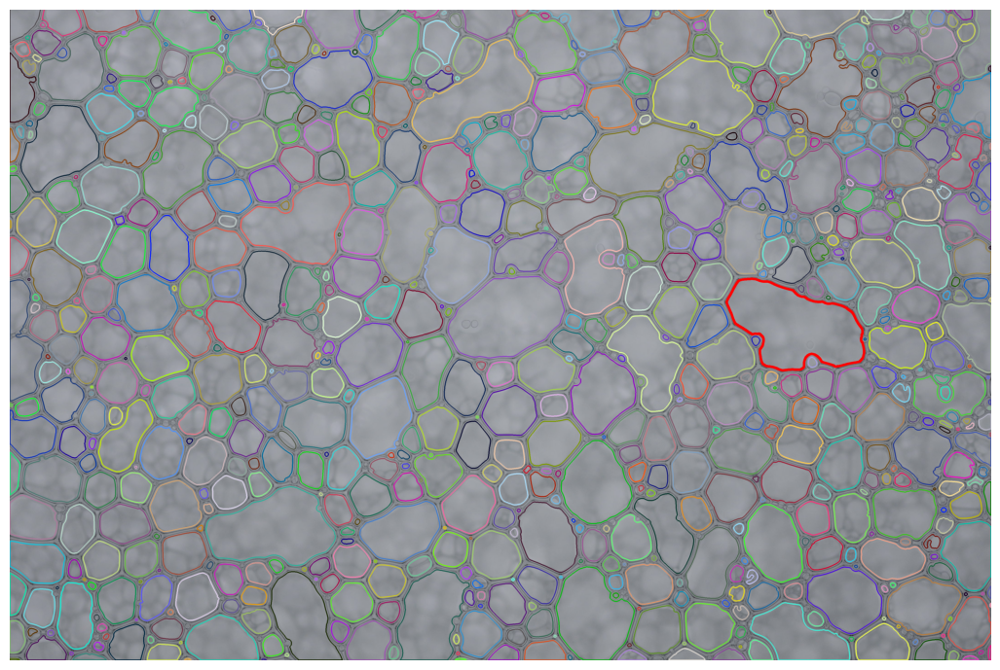

```
Canny
-----------------------
Number of bubbles:  735
Bubbles mean area: 12235.473
Bubbles max area:  155223.0
```

### Attempt 2 - Thresholding
I also tried to use thresholding as a different way to binarize the input image.

#### Binarization
```py
edges = cv2.adaptiveThreshold(filtered, 255, cv2.ADAPTIVE_THRESH_GAUSSIAN_C , cv2.THRESH_BINARY, 5, 2)
```

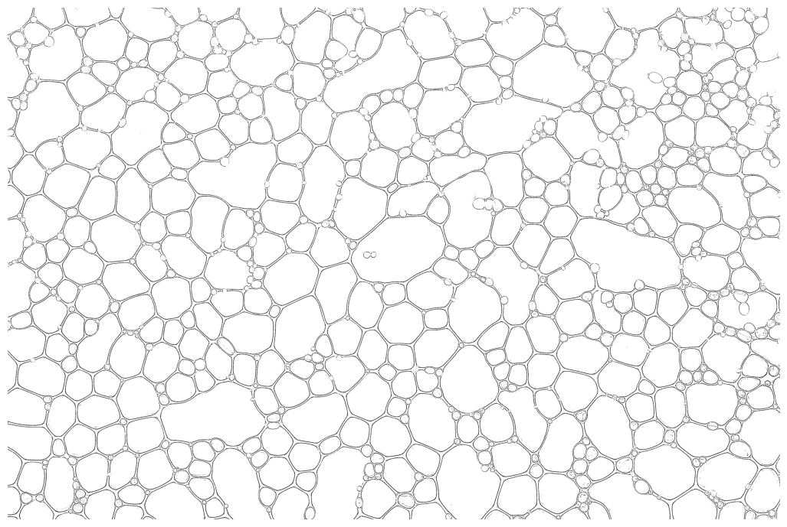

In this case, it is necessary to use adaptive thresholding, since global thresholding can be affected by different factors e.g. distribution of light during photography.

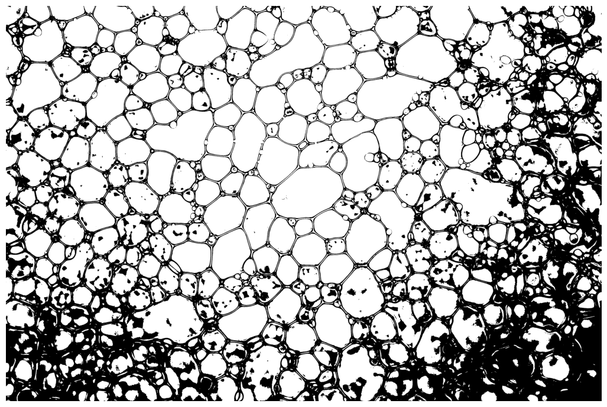

Subsequently, I used morphological **erode** and **opening** to refine the obtained mask.

```py
kernel = cv2.getStructuringElement(shape=cv2.MORPH_ELLIPSE, ksize=(11, 11))
edges = cv2.erode(edges, kernel, iterations=1)

kernel = cv2.getStructuringElement(shape=cv2.MORPH_ELLIPSE, ksize=(7, 7))
edges = cv2.morphologyEx(edges, cv2.MORPH_OPEN, kernel, iterations=2)
```

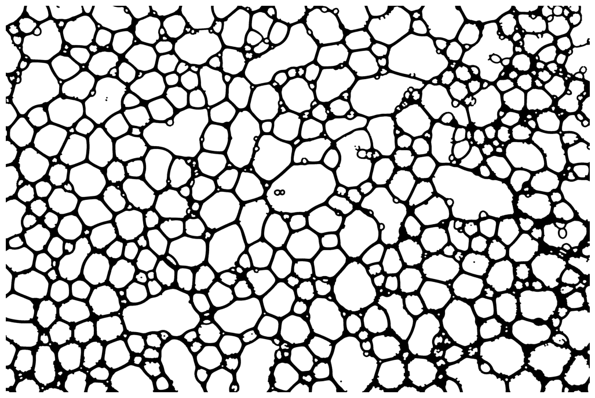

#### Contour analysis
The method for finding contours is the same as in the previous attempt.

#### Final Output
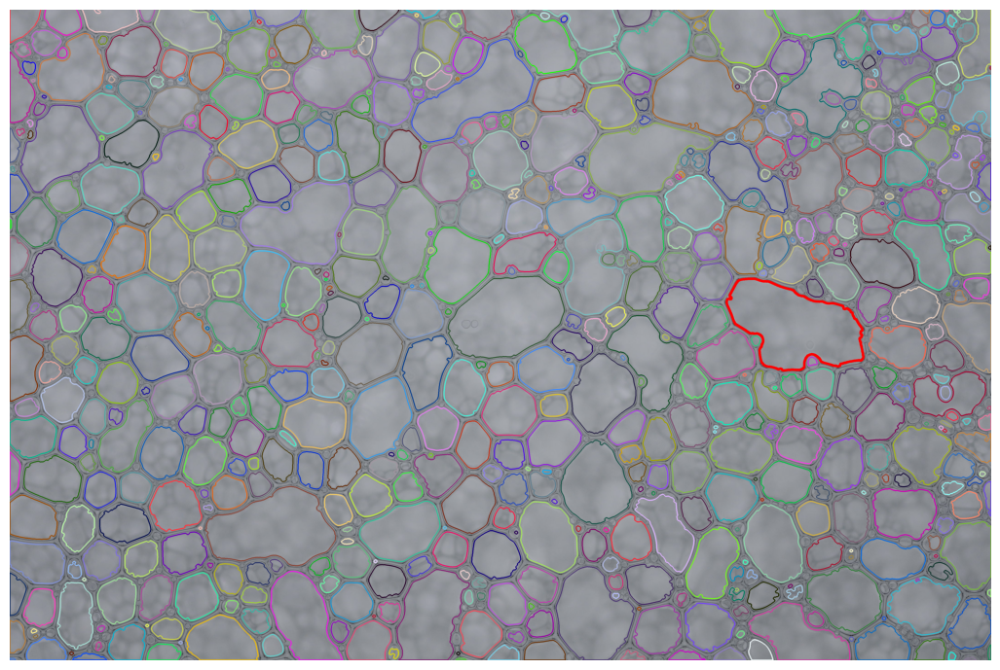

```
Thresholding
-----------------------
Number of bubbles:  636
Bubbles mean area: 14054.748
Bubbles max area:  154924.5
```

### Conclusion
Both methods for analyzing bubbles achieved comparable results. Both marked the same bubble as the largest.
On the other hand, they differ in the number of labeled bubbles (by 99) and also in the average area of ​​bubbles (difference 1819.275) and in the area of ​​the largest bubble (difference 298.5).

I consider the first method to be more successful, since I was able to more accurately mark a larger number of bubbles.

## Cells
In this case, I tried to segment individual cells from the image `TCGA-18-5592-01Z-00-DX1.tif`. The code is in `cells.ipynb`.

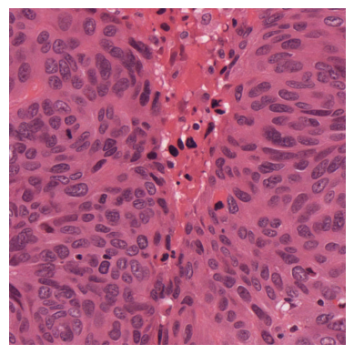

### Attempt 1
For this experiment, I followed the same procedure as for the image with bubbles. First, I converted the image to grayscale and then tried to filter it by using `cv2.GaussianBlur(gray, (3, 3), 0)`.

#### Binarization
In this case, it was sufficient to use global thresholding.

```py
_, mask = cv2.threshold(filtered, 0, 255, cv2.THRESH_OTSU)
```

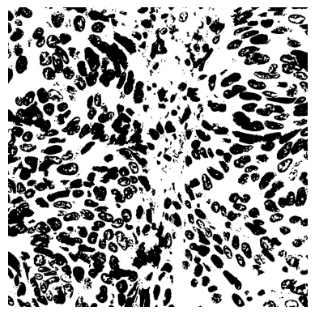

I noticed on the created mask that it contains quite a lot of black dots, where these dots do not represent the cells themselves. To remove them, I used a **closing** operation with kernel size `(7, 7)`, thanks to which I managed to partially clean the image.

```py
kernel = cv2.getStructuringElement(shape=cv2.MORPH_ELLIPSE, ksize=(7, 7))
mask = cv2.morphologyEx(mask, cv2.MORPH_CLOSE, kernel, iterations=1)
```

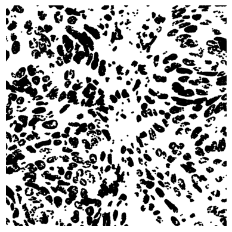

Next, I decided to apply the **erode** operation to partially fill the white spaces inside the cells.

```py
kernel = cv2.getStructuringElement(shape=cv2.MORPH_ELLIPSE, ksize=(3, 3))
mask = cv2.erode(mask, kernel, iterations=1)
```

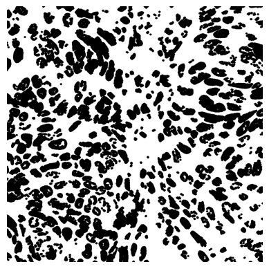

#### Contour Analysis
To find contours of the cells, I first inverted the acquired mask and, as with bubbles, identified the cell contours by using the `findContours` method.

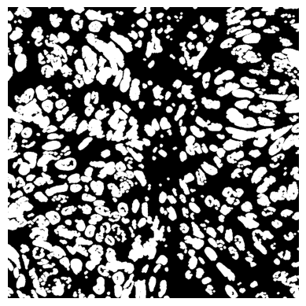

#### Final Output
As can be see in the image below, I didn't manage to separate the individual cells enough and the identified contours rather outline some kind of clusters of cells.

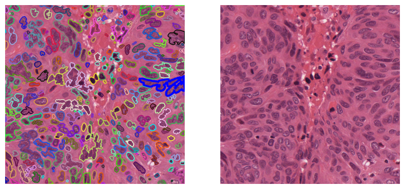

```
Take 1
-----------------------
Number of cells:  332
```

### Attempt 2
In this case, instead of converting the original image, I divided the image into individual channels, from which the **red** channel looked the most promising.

```py
gray = img[:, :, 2] # using only red channel
filtered = cv2.GaussianBlur(gray, (5, 5), 0)
```
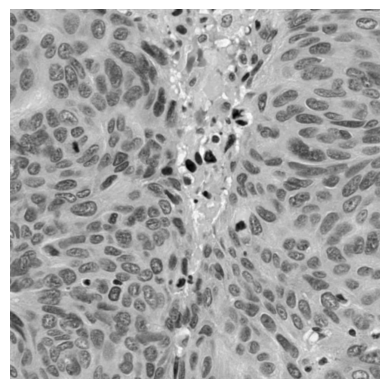

#### Binarization
In this experiment I also used global thresholding and inverted the acquired mask.

```py
_, mask = cv2.threshold(filtered, 0, 255, cv2.THRESH_OTSU)
mask = cv2.bitwise_not(mask)
```

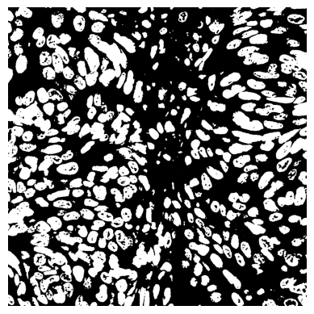

I subsequently applied **morphological opening**, thanks to which I was able to removed small white points and partially fill the inside of the cells.

```py
kernel = cv2.getStructuringElement(shape=cv2.MORPH_ELLIPSE, ksize=(11, 11))
mask = cv2.morphologyEx(mask, cv2.MORPH_OPEN, kernel, iterations=1)
```

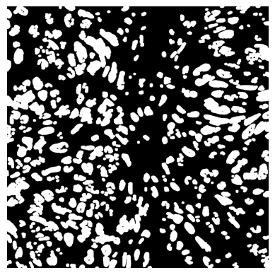

#### Contour Analysis
The contour analysis was also the same as in the previous experiments.

#### Final Output
In this case, I managed to mark a larger number of cells. Still, in some cases, larger clusters of cells were still marked.

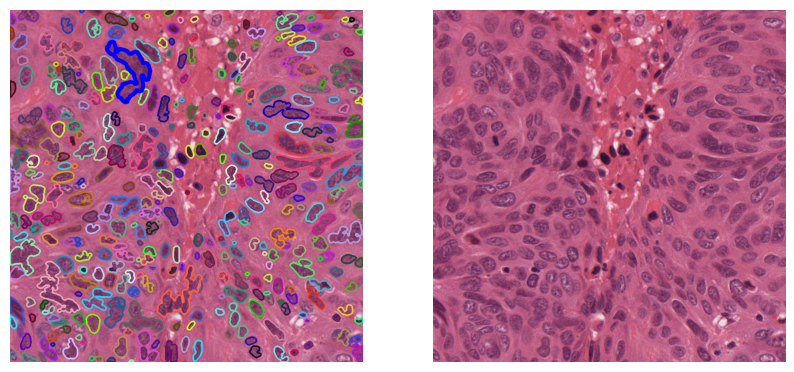

```
Take 2
-----------------------
Number of cells:  355
```

### Conclusion
The analyzed methods were essentially very similar. Both used the same filtering, binarization and contour analysis, and differed mainly in the applied morphological operations and in the processing of the original image. The second method was ultimately much more successful and marked **23 more cells**.

Despite the fact that I managed to improve the segmentation of individual cells, it would be interesting to use a completely different method of segmentation, for example **watershed** and **distance transform**, which are suitable precisely in cases where objects overlap.
