# assignment-2

## Image Enhancement
The source code for this part of the assignment can be found in `image_enhancement.ipynb`.

### Segmentation using the Lab color model

#### Image HMRegistred.png
At the beginning, we cut out a small part of the original image that contained only the cell itself. Subsequently, we loaded the two images and changed their data type from `uint8` to `float32` so that they could be more accurately represented in the Lab model. For the both images, we also changed the range from the original 0...255 to 0...1.
```py
img = cv2.imread('data/HMRegistred.png').astype(np.float32)
target = cv2.imread('data/HMRegistred_target.png').astype(np.float32)

img = img/255.0
target = target/255.0
```


Subsequently, we converted both images into the Lab color model.
```py
imgLab = cv2.cvtColor(img, cv2.COLOR_BGR2Lab)
targetLab = cv2.cvtColor(target, cv2.COLOR_BGR2Lab)
```

The next task was to calculate the average for the Lab channels in the second image to get the average cell color, which will be used for calculating of the difference between the original image and the cell cutout. The average color was calculated as follows `targetLab_mean = targetLab.mean(axis=(0, 1))` and we used the result in the calculation of delta E. Delta E actually meassures the difference between the values ​​in the individual channels of the original image with the values ​​of the corresponding channels in the average cell colors.
```py
delta_e = np.sqrt(np.sum(np.square(imgLab - targetLab_mean), axis=2))
```

For the image difference calculation, we also tried to only use 2 channels `a` and `b`. The channel `L` represents brightnes and the channels `a` and `b` colors, so `L` does not contribute to the color differences between pixels. The modified version of the delta E:
```py
delta_e = np.sqrt(np.sum(np.square(imgLab[:, :, :2] - targetLab_mean[:2]), axis=2))
```

The color difference for the first method:


The color difference for the second method:


There are really only minimal differences between the calculations, but for the sake of completeness, we used both of these methods for the segmentation itself, where we utilised thresholding. We used the `cv2.threshold()` method with `THRESH_OTSU`.
```py
_, mask = cv2.threshold(delta_e.astype(np.uint8), 0, 1, cv2.THRESH_OTSU)
```

Again, both methods are very similar, although in the second method we can see a larger number of cells.

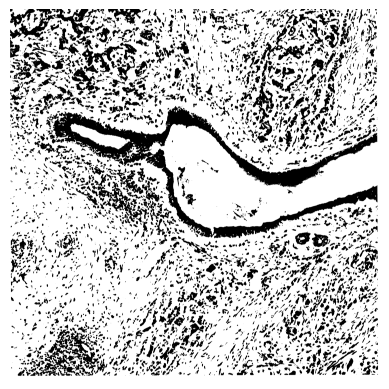

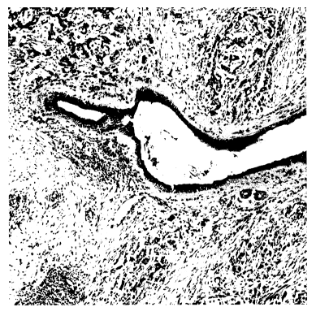

Finally, we applied the acquired mask to the original image by using `cv2.bitwise_and()`.
```py
result = cv2.bitwise_and(img, img, mask=mask)
```

Final segmentations:


Both of these methods segmented the individual cells quite well. The second method incorrectly segmentated cells in places where there is only tissue.

#### Picture P63Registred.png
For the second picture, we proceeded identically and therefore we only present the results from the individual phases. In this case, we also tried to calculate the delta E difference with both 3 and 2 channels.

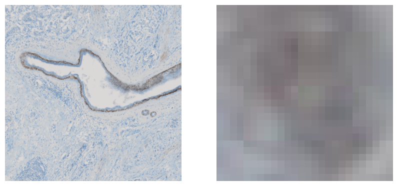

Delta E for the given two images. In this case, the difference between the two methods is more obvious, where the second method managed to mark a larger number of cells.


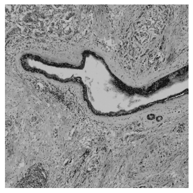

We can also observe the same difference after thresholding.

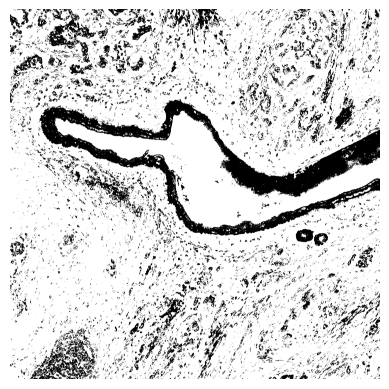


And finally, even after applying the resulting mask to the original image, we can see that with the second method we managed to segment a larger number of cells.


#### Conclusion
In the first image, we managed to segment a larger number of cells, which is due to the fact that in the first image the difference between the tissue and the cells themselves is more pronounced than in the second image. For the first image, there was also no significant difference after omitting the first (`L`) channel when calculating the difference between the images. On the other hand, this modification significantly changed the result for the second image.

### Localizing local descriptor images
At the beginning, we loaded the original large image and individual sections (patches), which we directly converted to grayscale.

```py
img = cv2.imread('data/local_descriptors_task/lookup.tif', 0)
patch1 = cv2.imread('data/local_descriptors_task/patch1.tif', 0)
patch2 = cv2.imread('data/local_descriptors_task/patch2.tif', 0)
patch3 = cv2.imread('data/local_descriptors_task/patch3.tif', 0)
```

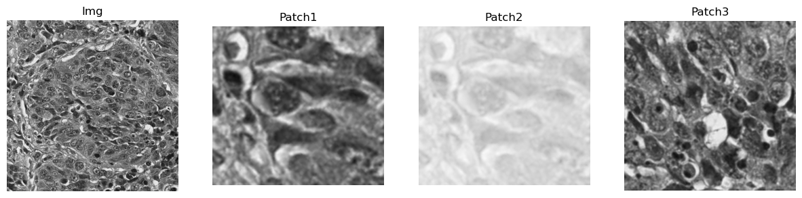

#### SIFT feature detector
We first used **SIFT** to detect significant or key points, which we initialized using `sift = cv2.SIFT_create()`. Subsequently, we used it to identify key points for the original image and individual sections.

```py
img_kp = sift.detect(img, None)
patch1_kp = sift.detect(patch1, None)
patch2_kp = sift.detect(patch2, None)
patch3_kp = sift.detect(patch3, None)
```

We then visualized these points using the `cv2.drawKeypoints()` method.

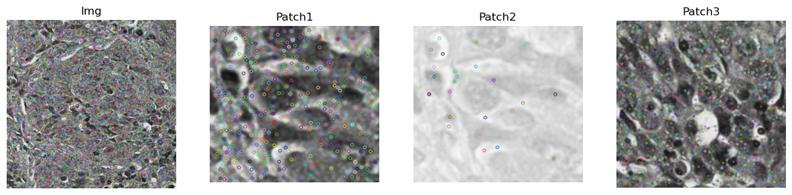

Next, we utilised various method to calculate feature descriptors.

#### SIFT to calculate feature descriptors
We were the first to use the **SIFT** method to calculate feature descriptors, using `sift.compute()`, this method also returns key points, so we only need one (second) output.

```py
img_descriptor = sift.compute(img, img_kp)[1]
patch1_descriptor = sift.compute(patch1, patch1_kp)[1]
patch2_descriptor = sift.compute(patch2, patch2_kp)[1]
patch3_descriptor = sift.compute(patch3, patch3_kp)[1]
```

Subsequently, we initialized the **brute-force matcher** `bf = cv2.BFMatcher()`, which is used to connect the descriptors of the large image and the patches. Since this part is repeated for other methods of finding keypoints and feature descriptors, we have created a simple function that calculates matches between descriptors and sorts them in descending order to remove unnecessary connections more easily.

```py
# based on https://docs.opencv.org/4.x/dc/dc3/tutorial_py_matcher.html
def compute_matches(img_desc, patch_desc):
    matches = bf.match(patch_desc, img_desc)
    matches = sorted(matches, key=lambda x:x.distance)
    return matches
```

For matches created in this way, we then calculated the *homography* matrix using the `cv2.findHomography()` method, with which we visualized the patch on the original image.

```py
# taken from https://docs.opencv.org/3.4/d1/de0/tutorial_py_feature_homography.html
def compute_homography(img, img_kp, patch, patch_kp, matches):
    patch_pts = np.float32([patch_kp[m.queryIdx].pt for m in matches]).reshape(-1, 1, 2)
    img_pts = np.float32([img_kp[m.trainIdx].pt for m in matches]).reshape(-1, 1, 2)

    H, _ = cv2.findHomography(patch_pts, img_pts, cv2.RANSAC)

    patch_w = patch.shape[1]
    patch_h = patch.shape[0]
    patch_corners = np.float32([[0, 0], [0, patch_h], [patch_w, patch_h], [patch_w, 0]]).reshape(-1, 1, 2)
    patch_corners_transformed = cv2.perspectiveTransform(patch_corners, H)
    new_img = cv2.polylines(img, [np.int32(patch_corners_transformed)], True, (0, 0, 255), 3, cv2.LINE_AA)

    return new_img
```

Finally, we visualized the created matches using the `cv2.drawMatches()` method, which looked like this for the first patch:

```py
result1 = cv2.drawMatches(patch1, patch1_kp, new_img1, img_kp, matches1[:10], None, flags=cv2.DrawMatchesFlags_NOT_DRAW_SINGLE_POINTS)
```

Results for methods **SIFT** and **SIFT**.


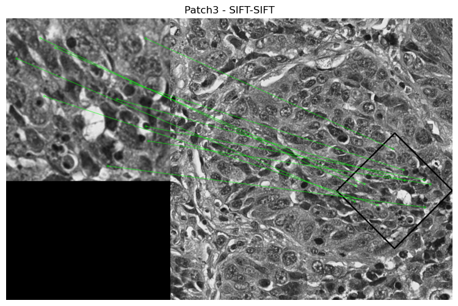

In this case, we were able to correctly identify all the cutouts.

#### ORB for calculating feature descriptors
When using this method, it was also necessary to initialize the **ORB** using `orb = cv2.ORB_create()`. Furthermore, the procedure was the same as when using the **SIFT** method, where we used the following to calculate local descriptors:

```py
img_descriptor = orb.compute(img, img_kp)[1]
patch1_descriptor = orb.compute(patch1, patch1_kp)[1]
patch2_descriptor = orb.compute(patch2, patch2_kp)[1]
patch3_descriptor = orb.compute(patch3, patch3_kp)[1]
```

After calculating the matches and homography with the aforementioned methods and finally drawing the obtained matches with the `cv2.drawMatches()` method, we got the following results:


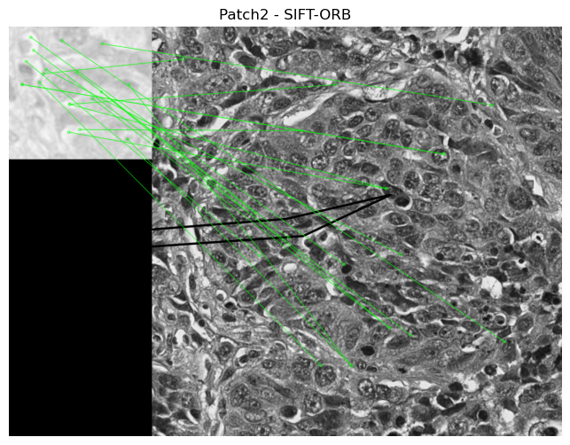


With this method, we were not able to locate the individual slices in the original image at all.

#### FAST feature detector
In this case, we use the `FAST` method to identify key points, which we initialised as `fast = cv2.FastFeatureDetector_create()` and identified individual key points by using:

```py
img_kp = fast.detect(img, None)
patch1_kp = fast.detect(patch1, None)
patch2_kp = fast.detect(patch2, None)
patch3_kp = fast.detect(patch3, None)
```

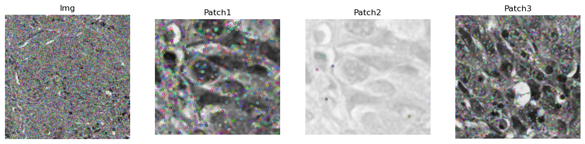

#### SIFT to calculate feature descriptors
As the first method for calculating local descriptors, we used the **SIFT** method, for which the final results looked as follows:

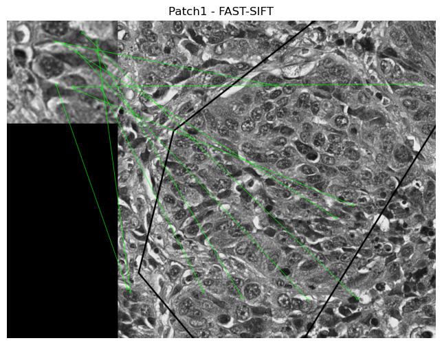


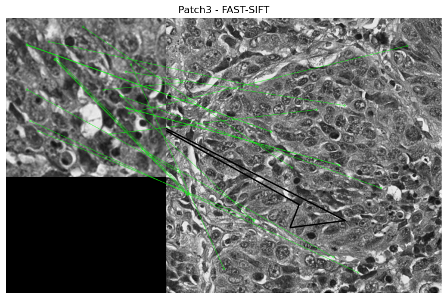

The combination of these two methods was also not successful and the extracted parts could not be located correctly.

#### ORB for calculating feature descriptors
Next, we tried to use a combination of the **FAST** and **ORB** methods, for which the results were equally inconsistent.


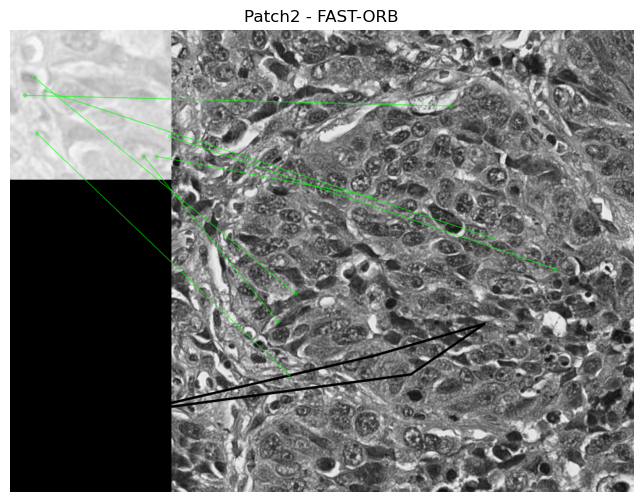

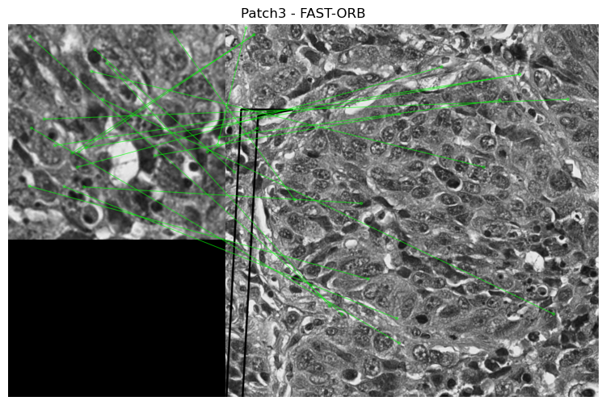

#### Harris corner detector
Lastly, we tried to use the Harris method in order to find key points in individual images. With this method, it was necessary to firstly identify individual corners by using the `cv2.cornerHarris()` method.

```py
img_corners = cv2.cornerHarris(img, 2, 3, 0.04)
patch1_corners = cv2.cornerHarris(patch1, 2, 3, 0.04)
patch2_corners = cv2.cornerHarris(patch2, 2, 3, 0.04)
patch3_corners = cv2.cornerHarris(patch3, 2, 3, 0.04)
```

And then create an array of points from them, which in this case represent the key points, so that they can be further used in the calculation of descriptors.

The resulting key points looked like this:


The calculation of local descriptors was already the same as with other methods

#### SIFT to calculate feature descriptors
For the **SIFT** method, these descriptors looked like this:


When, as with most of the previous combinations, it was not possible to locate the individual cutouts correctly.

#### ORB for calculating feature descriptors
With the **ORB** method, the results were also the same:

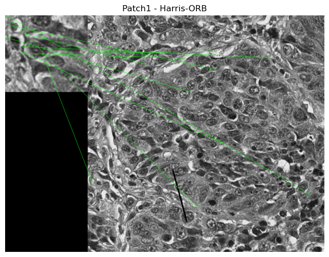


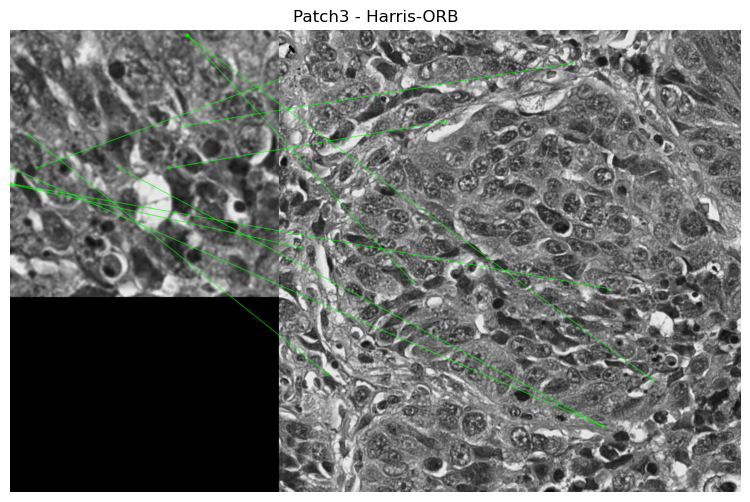

#### Evaluation
In our case, the best combination was to use the **SIFT** method to both identify key points and to also find local descriptors. In this case, we managed to sufficiently locate individual sections, which is due to the fact that the **SIFT** method itself is not affected by different scales, rotations, and also the light differences of the images. With the other combinations, we could not locate these cutouts almost at all.

We believe that another successful combination could be a combination of **SIFT** and **SURF** methods, since the **SURF** method is very similar to the **SIFT** method. We were unable to verify this assumption, as we had a problem "running" the **SURF** method in our environment.

## Image correction
The source code for this part of the assignment can be found in `image_correction.ipynb`.

### Image HMRegistred.png

First, we converted the image to the given color models using the `cv2.cvtColor()` method, for which we found and plotted histograms for their individual channels, for which we used the `cv2.calcHist()` method.

```py
first_hist = cv2.calcHist([img], [0], None, [256], [0, 255])
second_hist = cv2.calcHist([img], [1], None, [256], [0, 255])
third_hist = cv2.calcHist([img], [2], None, [256], [0, 255])
```

Where the histogram for the RGB image looked like this:
```py
imgRGB = cv2.cvtColor(img, cv2.COLOR_BGR2RGB)
```


For grayscale image:
```py
gray = cv2.cvtColor(img, cv2.COLOR_BGR2GRAY)
```


For the colour model YCrCb:
```py
imgYCrCb = cv2.cvtColor(img, cv2.COLOR_BGR2YCrCb)
```

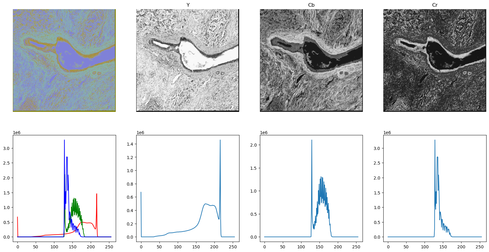

For HSV:
```py
imgHSV = cv2.cvtColor(img, cv2.COLOR_BGR2HSV)
```


For XYZ:
```py
imgXYZ = cv2.cvtColor(img, cv2.COLOR_BGR2XYZ)
```

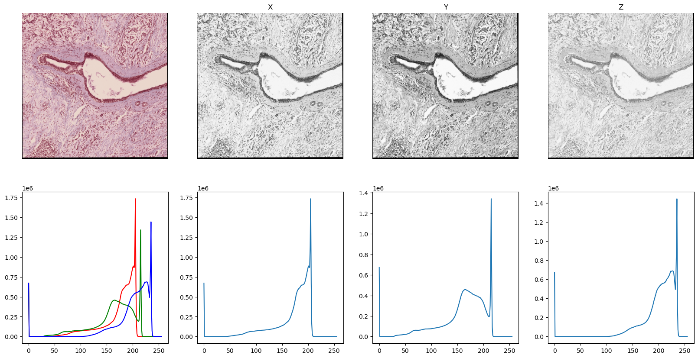

And for Lab:
```py
imgLab = cv2.cvtColor(img, cv2.COLOR_BGR2Lab)
```

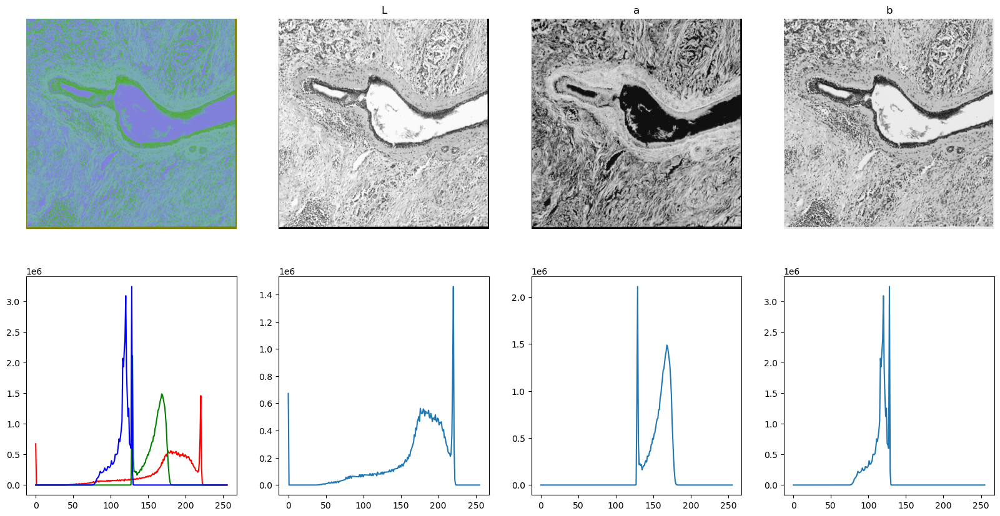

### Image P63Registred.png
We proceeded in the same way with the second image, where the histograms looked like this:

For RGB:


For grayscale:

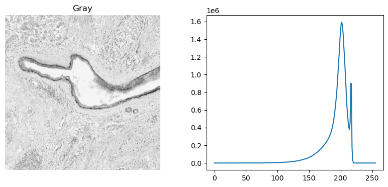

For YCrCb:


For HSV:

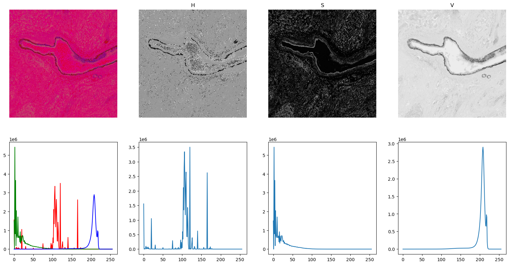

For XYZ:


For Lab:


