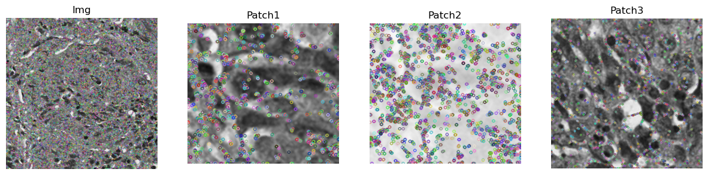

# assignment-2

meno: Jakub Povinec
- - - -
## Image enhancement
Zdrojový kód pre túto časť zadania sa nachádza v  `image_enhancement.ipynb`.

### Segmentácia použitím Lab farebného modelu

#### Obrázok HMRegistred.png
Na začiatku sme z pôvodného obrázka vyrezali malú časť, ktorá obsahovala len samotnú bunku. Následne sme dané dva obrázky načítali a zmenili ich dátový typ z  `uint8` na `float32`, aby sa dali presnejšie reprezentovať  v Lab modeli. Obidvom obrázkom sme taktiež zmenili rozsah z pôvodných 0...255 na 0...1. 
```
img = cv2.imread('data/HMRegistred.png').astype(np.float32)
target = cv2.imread('data/HMRegistred_target.png').astype(np.float32)

img = img/255.0
target = target/255.0
```


Následne sme oba obrázky prekonvertovali do Lab farebného modelu.
```
imgLab = cv2.cvtColor(img, cv2.COLOR_BGR2Lab)
targetLab = cv2.cvtColor(target, cv2.COLOR_BGR2Lab)
```

Ďalšou úlohou bolo vypočítať priemer pre náš kanály Lab v druhom obrázku a tak získať priemernu farbu bunky, ktorá sa použije pri vypočítaní rozdielu medzi pôvodným obrázkom a výrezom bunky. Priemernú farbu sme vypočítali nasledovne `targetLab_mean = targetLab.mean(axis=(0, 1))` a výsledok sme použili pri výpočte delta E, kde sme vlastne vypočítali rozdiel medzi hodnotami v jednotlivých kanáloch pôvodného obrázka a hodnotami príslušných kanálov v nami vypočítanej priemernej farby buniek.
```
delta_e = np.sqrt(np.sum(np.square(imgLab - targetLab_mean), axis=2))
```

 V prípade výpočtu rozdielu obrázkov sme taktiež vyskúšali použiť len 2 kanály `a` a `b`, keďže kanál `L` predstavuje jas a `a` a `b`  farby, teda `L`  neprispieva k farebným rozdielom medzi pixelmi. Táto verzia delta E vyzerala nasledovne:
```
delta_e = np.sqrt(np.sum(np.square(imgLab[:, :, :2] - targetLab_mean[:2]), axis=2))
```

Rozdiel farieb pre 1. metódu:


Rozdiel farieb pre 2. metódu:


Medzi rozdielmi sú naozaj len minimálne rozdiely, no pre úplnosť sme vyskúšali obidve metódy aj pri samotnej segmentácií pomocou thresholdingu, kde sme použili metódu `cv2.threshold()` s `THRESH_OTSU`.
```
_, mask = cv2.threshold(delta_e.astype(np.uint8), 0, 1, cv2.THRESH_OTSU)
```

Znovu si sú obe metódy veľmi podobné aj keď pri druhej sa objavuje väčšie množstvo buniek. 


Nakoniec sme pomocou  `cv2.bitwise_and()`  aplikovali masku na pôvodný obrázok.
```
result = cv2.bitwise_and(img, img, mask=mask)
```

Finálne segmentácie vyzerali nasledovne:


Obidve metódy pomerne dobre vysegmentovali jednotlivé bunky, no pri druhej metóde sú na niektorých miestach, v ktorých sa nachádza len tkanivo nesprávne objavujú aj čierne segmentácie.

#### Obrázok P63Registred.png
Pri druhom obrázku sme postupovali identicky a preto uvádzame už len výsledky z jednotlivých fáz. V tomto prípade sme taktiež vyskúšali počítať rozdiel delta E aj s 3 aj s 2 kanálmi.


Delta E  pre dané dva obrázky. V tomto prípade je rozdiel medzi dvomi metódami zjavnejší, kedy pri druhej metóde sa podarilo označiť väčší počet buniek.


Rovnaký rozdiel môžeme pozorovať aj po thresholdingu.


A na koniec aj po aplikovaní vzniknutej masky na pôvodný obrázok, kde môžeme vidieť, že pri druhej metóde sa nám podarilo vysegmentovať väčší počet buniek. 


#### Zhodnotenie
Pri prvom obrázku sa nám podarilo vysegmentovať väčší počet buniek, čo je spôsobené tým, že na prvom obrázku je rozdiel medzi tkanivom a samotnými bunkami výraznejší ako na druhom obrázku. Pri prvom obrázku taktiež nebol výrazný rozdiel po vynechaní prvého ( `L`) kanála pri počítaní rozdielu medzi obrázkami. Na druhú stranu, táto modifikácia výrazne zmenila výsledok pri druhom obrázku.

### Lokalizácia obrázkov lokálnych deskriptorov
Na začiatku sme si načítali pôvodný veľký obrázok a jednotlivé výrezy (patches), ktoré sme si rovno prekonvertovali do grayscale.

```
img = cv2.imread('data/local_descriptors_task/lookup.tif', 0)
patch1 = cv2.imread('data/local_descriptors_task/patch1.tif', 0)
patch2 = cv2.imread('data/local_descriptors_task/patch2.tif', 0)
patch3 = cv2.imread('data/local_descriptors_task/patch3.tif', 0)
```


#### SIFT feature detector
Ako prvý sme použili na detekciu významných alebo kľúčových bodov (key points) **SIFT**, ktorý sme si inicializovali pomocou `sift = cv2.SIFT_create()`. Následne sme pomocou neho identifikovali kľúčové body pre pôvodný obrázok a jednotlivé výrezy.
```
img_kp = sift.detect(img, None)
patch1_kp = sift.detect(patch1, None)
patch2_kp = sift.detect(patch2, None)
patch3_kp = sift.detect(patch3, None)
```

Tieto body sme si následne vizualizovali pomocou metódy `cv2.drawKeypoints()`.


Ako ďalšie sme už pomocou rôznych metód vypočítali `feature descriptors`.

#### SIFT na výpočet feature descriptors
Ako prvú sme použili metódu **SIFT** aj na výpočet feature descriptorov, pomocou `sift.compute()`, táto metóda vracia znovu aj kľúčové body, preto nám stačí len jeden (druhý) výstup.
```
img_descriptor = sift.compute(img, img_kp)[1]
patch1_descriptor = sift.compute(patch1, patch1_kp)[1]
patch2_descriptor = sift.compute(patch2, patch2_kp)[1]
patch3_descriptor = sift.compute(patch3, patch3_kp)[1]
```

Následne sme si inicializovali **brute-force matcher** `bf = cv2.BFMatcher()` , ktorý slúži na spájanie deskriptorov veľkého obrázku a výrezov. Keďže sa táto časť opakuje aj pri iných metódach hľadania klúčových bodov a feature descriptorov, vytvorili sme si jednoduchú funkciu, ktorá vypočíta zhody medzi descriptormi a zoradí ich zostupne, aby sa dali jednoduchšie odstrániť  zbytočné spojenia.
```
# based on https://docs.opencv.org/4.x/dc/dc3/tutorial_py_matcher.html
def compute_matches(img_desc, patch_desc):
    matches = bf.match(patch_desc, img_desc)
    matches = sorted(matches, key=lambda x:x.distance)
    return matches
```

Pre takto vytvorené zhody sme náslende pomocou metódy `cv2.findHomography()` vypočítali maticu *homografie*, pomocou ktorej sme si zobrazili patch na pôvodnom obrázku.
```
# taken from https://docs.opencv.org/3.4/d1/de0/tutorial_py_feature_homography.html
def compute_homography(img, img_kp, patch, patch_kp, matches):
    patch_pts = np.float32([patch_kp[m.queryIdx].pt for m in matches]).reshape(-1, 1, 2)
    img_pts = np.float32([img_kp[m.trainIdx].pt for m in matches]).reshape(-1, 1, 2)

    H, _ = cv2.findHomography(patch_pts, img_pts, cv2.RANSAC)

    patch_w = patch.shape[1]
    patch_h = patch.shape[0]
    patch_corners = np.float32([[0, 0], [0, patch_h], [patch_w, patch_h], [patch_w, 0]]).reshape(-1, 1, 2)
    patch_corners_transformed = cv2.perspectiveTransform(patch_corners, H)
    new_img = cv2.polylines(img, [np.int32(patch_corners_transformed)], True, (0, 0, 255), 3, cv2.LINE_AA)

    return new_img 
```

Nakoniec sme si vytvorené zhody vizualizovali pomocou metódy `cv2.drawMatches()` , ktorá pre napr. prvý výrez vyzerala nasledovne:
```
result1 = cv2.drawMatches(patch1, patch1_kp, new_img1, img_kp, matches1[:10], None, flags=cv2.DrawMatchesFlags_NOT_DRAW_SINGLE_POINTS)
```

Výsledky pre metódy **SIFT** a **SIFT**.


V tomto prípade sme dokázali správne identifikovať všetky výrezy. 

#### ORB na výpočet feature descriptors
Pri použití tejto metódy bolo taktiež najskôr potrebné inicializovať **ORB** pomocou `orb = cv2.ORB_create()`. Ďalej bol postup už rovnaký ako pri použití metódy **SIFT**, kde na výpočet lokálnych deskriptorov sme použili:
```
img_descriptor = orb.compute(img, img_kp)[1]
patch1_descriptor = orb.compute(patch1, patch1_kp)[1]
patch2_descriptor = orb.compute(patch2, patch2_kp)[1]
patch3_descriptor = orb.compute(patch3, patch3_kp)[1]
```

Po vypočítaní zhôd a homografie už spomínanými metódami a nakoniec vykreslením získaných zhôd metódou `cv2.drawMatches()`, sme dostali nasledujúce výsledky:


V tejto metóde sa nám vôbec nepodarilo lokalizovať jednotlivé výrezy na pôvodnom obrázku.

#### FAST feature detector
V tomto prípade použijeme na identifikovanie kľúčových bodov metódu `FAST`, ktorú si inicializujeme pomocou `fast = cv2.FastFeatureDetector_create()` a jednotlivé kľúčové body identifikujeme pomocou: 
```
img_kp = fast.detect(img, None)
patch1_kp = fast.detect(patch1, None)
patch2_kp = fast.detect(patch2, None)
patch3_kp = fast.detect(patch3, None)
```


#### SIFT na výpočet feature descriptors
Ako prvú metódu na výpočet lokálnych deskriptorov sme použili metódu **SIFT**, pre ktorú vyzerali finálne výsledky nasledovne:


Kombinácia týchto dvoch metód taktiež nebola úspešná a vyrezané časti sa nepodarilo správne lokalizovať.

#### ORB na výpočet feature descriptors
Ako ďalšiu sme vyskúšali použiť kombináciu metód **FAST** a **ORB** , pre ktorú boli výsledku rovnako neuspojojivé.


#### Harris corner detector
Ako posledné sme vyskúšali použiť metódu Harris na nájdenie kľučových bodov v jednotlivých obrázkoch. Pri tejto metóde bolo potrebné najskôr identifikovať jednotlivé rohy pomocou metódy `cv2.cornerHarris()`.
```
img_corners = cv2.cornerHarris(img, 2, 3, 0.04)
patch1_corners = cv2.cornerHarris(patch1, 2, 3, 0.04)
patch2_corners = cv2.cornerHarris(patch2, 2, 3, 0.04)
patch3_corners = cv2.cornerHarris(patch3, 2, 3, 0.04)
```

A následne z nich vytvoriť pole bodov, ktoré v tomto prípade reprezentuje kľúčové body, aby sa mohli ďalej použiť pri výpočte deskriptorov.

Výsledné kľúčové body vyzerali nasledovne:



Výpočet lokálnych dekriptorov bol už taktiež rovnaký ako pri iných metódach

#### SIFT na výpočet feature descriptors
Pre metódu **SIFT**, vyzerali tieto deskriptory nasledovne: 


Kedy sa rovnako ako pri väčšine predchádzajúcich kombinácií nepodarilo jednotlivé výrezy správne lokalizovať.

#### ORB na výpočet feature descriptors
Pri metóde **ORB**, boli výsledky taktiež rovnaké:


#### Zhodnotenie
V našom prípade bola najlepšia kombinácia použitie metódy **SIFT** na identifikovanie kľúčových bodov ako aj na nájdenie lokálnych deskriptorov. Pri tejto kombinácií sa nám podarilo viac-menej presne lokalizovať jednotlivé výrezy, čo je spôsobené tým, že samotnú metódu **SIFT** neovplyvňujú rôzne mierky, rotácie a taktiež aj svetelné rozdiely obrázkov. Pri ostatných kombináciach sa nám tieto výrezy nepodarilo lokalizovať takmer vôbec. 

Domnievame sa, že ďalšou úspešnou kombináciou by mohla byť kombinácia metód **SIFT** a **SURF**, keďže metóda **SURF** je veľmi podobná metóde **SIFT**. Túto domnienku sa nám nepodarilo overiť, keďže sme mali problém v našom prostredí metódu **SURF** "rozbehať".

## Image correction
Zdrojový kód pre túto časť zadania sa nachádza v  `image_correction.ipynb`.

### Obrázok HMRegistred.png

Ako prvé sme si obrázok prekonvertovali do daných farebných modelov pomocou metódy `cv2.cvtColor()`, pre ktoré sme zistili a vykreslili histogramy  pre ich jednotlivé kanály, na čo sme použili metódu `cv2.calcHist()`.

```
first_hist = cv2.calcHist([img], [0], None, [256], [0, 255])
second_hist = cv2.calcHist([img], [1], None, [256], [0, 255])
third_hist = cv2.calcHist([img], [2], None, [256], [0, 255])
```

Kde histogram pre RGB obrázok vyzeral nasledovne:
```
imgRGB = cv2.cvtColor(img, cv2.COLOR_BGR2RGB)
```


Pre grayscale obrázok:
```
gray = cv2.cvtColor(img, cv2.COLOR_BGR2GRAY)
```


Pre farebný model YCrCb:
```
imgYCrCb = cv2.cvtColor(img, cv2.COLOR_BGR2YCrCb)
```


Pre HSV:
```
imgHSV = cv2.cvtColor(img, cv2.COLOR_BGR2HSV)
```


Pre XYZ:
```
imgXYZ = cv2.cvtColor(img, cv2.COLOR_BGR2XYZ)
```


A nakoniec pre Lab:
```
imgLab = cv2.cvtColor(img, cv2.COLOR_BGR2Lab)
```


### Obrázok P63Registred.png
Rovnako sme postupovali aj pri druhom obrázku, kde vyzerali histogramy nasledovne:

Pre RGB:


Pre grayscale:


Pre YCrCb:


Pre HSV:


Pre XYZ:


Pre Lab:

