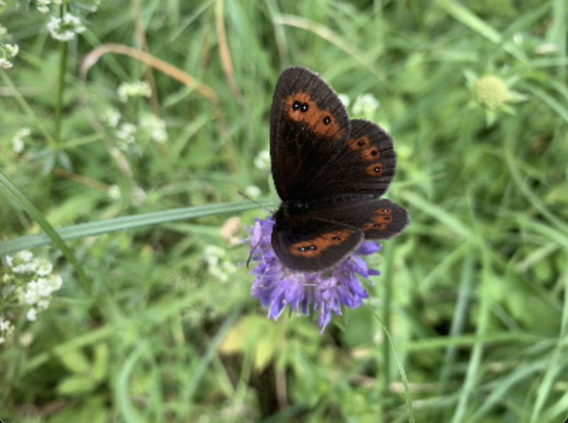
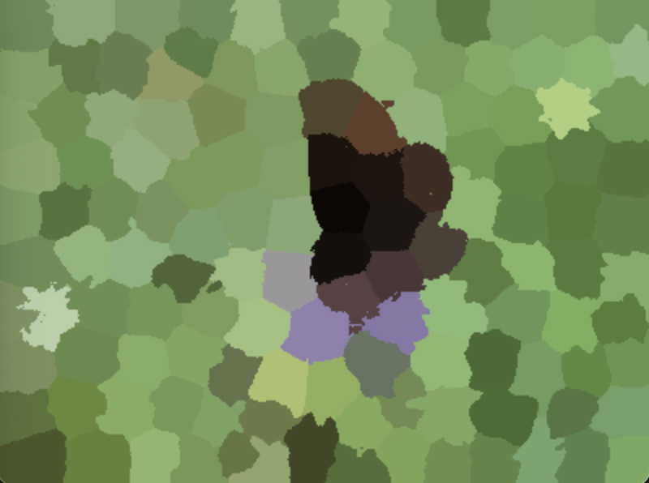
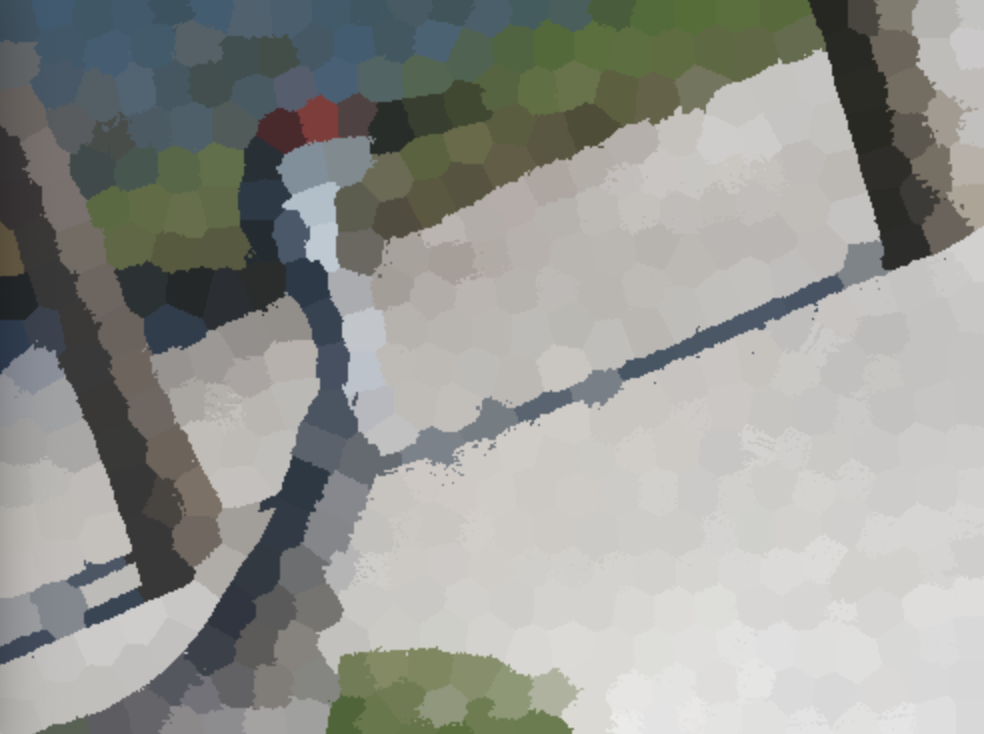
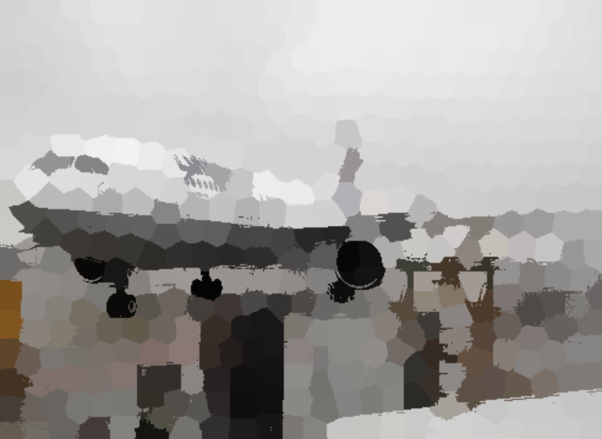
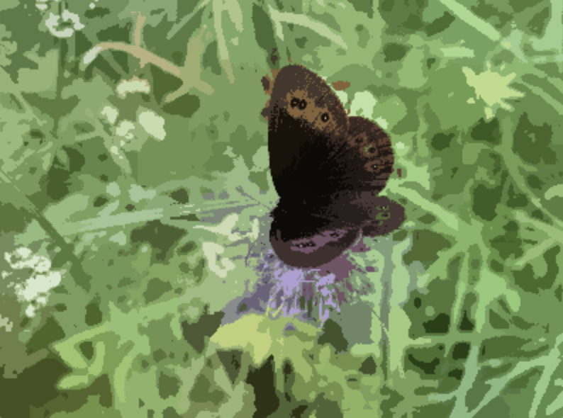
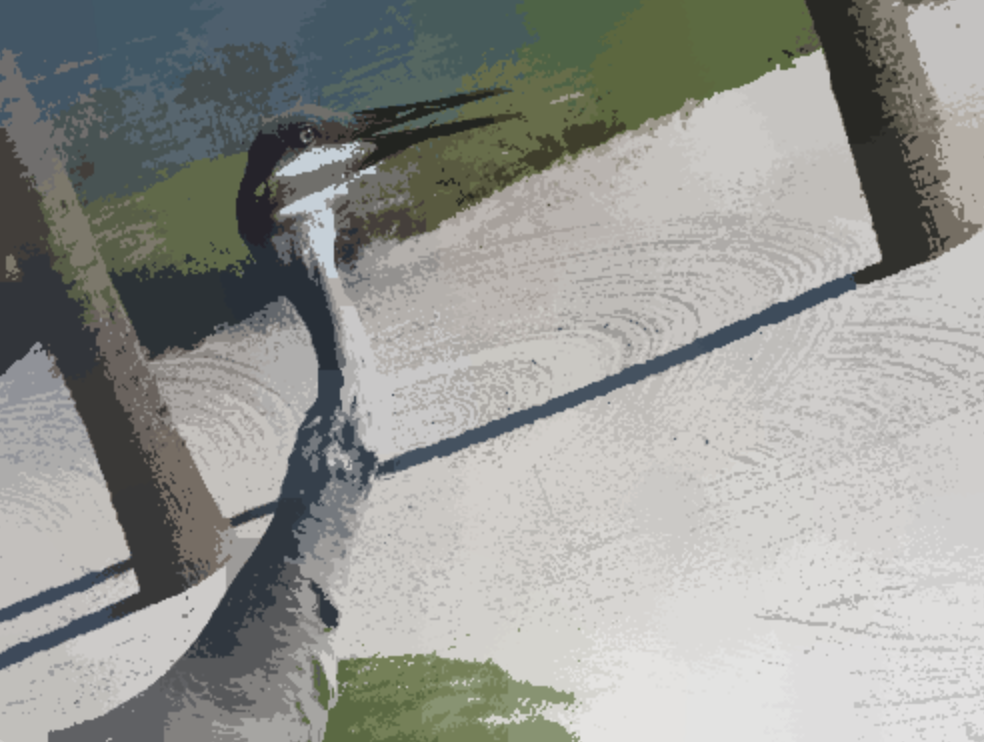

# assignment-3

## Motion tracking
The source code for this part of the assignment is in `motion.py`. The part of the code that is used for reading of the video is more or less the same for all tasks and consists of iterating the given video frame by frame, where each frame is first converted to grayscale so that it can be used in other methods.

```py
# [OpenCV: Optical Flow](https://docs.opencv.org/4.x/d4/dee/tutorial_optical_flow.html)
vid = cv2.VideoCapture('data/motion/AVG-TownCentre-raw.mp4')
ret, frame = vid.read()
old_gray = cv2.cvtColor(frame, cv2.COLOR_BGR2GRAY)

while(vid.isOpened()):
    ret, frame = vid.read()
    if not ret or (cv2.waitKey(30) & 0xff == 27):
        break

    gray = cv2.cvtColor(frame, cv2.COLOR_BGR2GRAY)

    ...

vid.release()
```

In the experiments, we used data from [Pedestrian Dataset | Kaggle](https://www.kaggle.com/datasets/smeschke/pedestrian-dataset?resource=download) and [MOT Challenge - Data](https://motchallenge.net/data/MOT15/).

### Sparse optical flow
In this task, we tried to determine **sparse optical flow** by using the **Lucas-Kanade** method. We also visualized the trajectory of a moving objects and marked them with bounding boxes.

At fist, we obtained the initial key points by using the `goodFeaturesToTrack()` method from the first 'frame' of the given video.

```py
old_gray = cv2.cvtColor(frame, cv2.COLOR_BGR2GRAY)
kp0 = cv2.goodFeaturesToTrack(old_gray, mask=None, qualityLevel=0.01, maxCorners=300, minDistance=10)
```

We determined the parameters of the function experimentally based on our input data.

Subsequently, we have already calculated the 'optical flow'by  using the `calcOpticalFlowPyrLK()` method, which in addition to other parameters also includes the previous frame, the current frame and the current points that we obtained in the previous step.

```py
# calculate optical flow
gray = cv2.cvtColor(frame, cv2.COLOR_BGR2GRAY)
kp1, st, _ = cv2.calcOpticalFlowPyrLK(old_gray, gray, kp0, None, winSize=(21, 21), maxLevel=5, criteria=(cv2.TERM_CRITERIA_EPS | cv2.TERM_CRITERIA_COUNT, 5, 0.01))
```

This method returns new keypoints and a status field (the same length as the points array) that tells whether the motion vector was found for the given point. We will use this field to remove invalid points.

```py
if kp1 is not None:
    good_new = kp1[st==1]
    good_old = kp0[st==1]
```

Next, we calculate the Euclidean distance between the new and old points, which we will use to further remove inappropriate points. In this way, we can remove most of the points from the background that represented some small movement that is not interesting for us, e.g. movement of branches in the wind.

```py
# calculate diff between points
diff = []
for i, _ in enumerate(good_new):
    diff.append(math.dist(good_new[i], good_old[i]))

for i, (new, old) in enumerate(zip(good_new, good_old)):
    # throw away stationary keypoints
    if diff[i] > dist_threshold:
          moving_kp.append(new)

print('remaining keypoints: ', len(moving_kp))
```

Since we remove the points during the transition of the video, it is necessary to re-create them if there are not enough of them.

```py
# generate new keypoints
if len(kp0) < 5:
    new_kp = cv2.goodFeaturesToTrack(gray, mask=None, qualityLevel=0.05, maxCorners=200, minDistance=30)
    kp0 = np.concatenate((kp0, new_kp), axis=0)
```

Finally, we just draw the bounding box for the obtained points.

```py
# draw bounding box
if len(moving_kp) > 1:
    x, y, w, h = cv2.boundingRect(np.array(moving_kp))
    frame = cv2.rectangle(frame, (x, y), (x + w, y + h), (0, 255, 0), 2)
```


*Sparse flow*


*Sparse flow in dark*

We managed to fine-tune this method quite well for the first example. On the other hand, it still has major shortcomings when it comes to video in the dark.

### Background subtraction methods
Next, we tried the **MoG** and **KNN** methods for segmentation of moving objects and also used them for their detection.

#### Background segmentation
First, we created a kernel (for morphological operations) and initialized **MoG** and **KNN** subtractors.

```py
kernel = cv2.getStructuringElement(cv2.MORPH_ELLIPSE, (5, 5))
mog = cv2.createBackgroundSubtractorMOG2(varThreshold=25, detectShadows=True)
knn = cv2.createBackgroundSubtractorKNN(dist2Threshold=300, detectShadows=True)
```

Furthermore, it was enough to use the created objects for individual video frames. Both subtractors return a binary mask, which we further modified by using morphological opening (removal of small artifacts) and dilation (enlargement of the outline of the object).

```py
while(vid.isOpened()):
    ret, frame = vid.read()

    mask_mog = mog.apply(frame)
    mask_mog = cv2.morphologyEx(mask_mog, cv2.MORPH_OPEN, kernel)
    mask_mog = cv2.dilate(mask_mog, kernel)

    mask_knn = knn.apply(frame)
    mask_knn = cv2.morphologyEx(mask_knn, cv2.MORPH_OPEN, kernel)
    mask_knn = cv2.dilate(mask_knn, kernel)
```


*MoG*


*KNN*

- - - -


*MoG in dark*


*KNN in dark*

For the first video, the result is almost identical, but for the video in the dark, the **MoG** method is better, since the mask of the object is visible trhought the whole video.

#### Object detection
To detect the object, we first created contours in the acquired mask, from which we selected only the largest one and then created a bounding box for it. To get the coordinates of the bounding box, we created our own function `get_bounding_box()`.

```py
def get_bounding_box(mask, method=''):
   box = None
	 if method == 'contours':
       contours, _ = cv2.findContours(mask, cv2.RETR_EXTERNAL, cv2.CHAIN_APPROX_SIMPLE)
       if len(contours) > 0:
           largest_contour = max(contours, key=cv2.contourArea)
           x, y, w, h = cv2.boundingRect(largest_contour)
           box = {'x': x, 'y': y, 'w': w, 'h': h}
   return box
```

```py
# draw bounding boxes
box_mog = get_bounding_box(mask_mog, method='contours')
if box_mog != None:
    frame = cv2.rectangle(
        frame, (box_mog['x'], box_mog['y']), (box_mog['x'] + box_mog['w'], box_mog['y'] + box_mog['h']), (0, 255, 0), 2
    )

box_knn = get_bounding_box(mask_knn, method='contours')
if box_knn != None:
    frame = cv2.rectangle(
        frame, (box_knn['x'], box_knn['y']), (box_knn['x'] + box_knn['w'], box_knn['y'] + box_knn['h']), (0, 0, 255), 2
    )
```

Green bounding box represents **MoG** and red **KNN**.


*Comparison of bounding boxes for MoG and KNN*


*Comparison of bounding boxes for MoG and KNN in the dark*

#### Running average
Next, we also tried using the **running average** method for segmentation of a moving object. This method calculates a weighted average from the last frames. At the beginning, we initialized the variable that represented this average to the value of the first frame in grayscale.

```py
running_avg = np.float32(cv2.cvtColor(frame, cv2.COLOR_BGR2GRAY))
```

Next we use the `accumulateWeighted()` function to update it.

```py
# update the running average
cv2.accumulateWeighted(gray, running_avg, alpha=0.4)
```

In order to obtain the mask of the moving object, we calculated the difference between the current frame and this average, thresholded the result and further modified it by using morphological operations.

```py
# create binary mask from the computed difference
_, mask = cv2.threshold(diff, 10, 255, cv2.THRESH_BINARY)
mask = cv2.morphologyEx(mask, cv2.MORPH_CLOSE, kernel)
mask = cv2.dilate(mask, kernel, iterations=2)
```

Finally, we drew a bounding box around the acquired mask by using the same method as in the previous experiments.

```py
# draw bounding box
box = get_bounding_box(mask, method='contours')
if box != None:
    frame = cv2.rectangle(frame, (box['x'], box['y']), (box['x'] + box['w'], box['y'] + box['h']), (0, 255, 0), 2)
```


*Bounding box for the running average method*


*Created mask for the running average method*


*Bounding box for the running average method in the dark*


*Created mask for the running average method in the dark*

Similar to the previous experiments with the **KNN** method, also in this case the results were very good on the first video, but we did not manage to segment the object sufficiently on the dark video.

### Improvement of initial method for sparse flow
Next, we decided to improve the sparse flow calculation method using a mask created with **MoG**. For the most part, the two methods are the same, and the only difference is in the keypoint extraction method in which we specified the created mask.

```py
kp0 = cv2.goodFeaturesToTrack(old_gray, mask=mask_mog, qualityLevel=0.01, maxCorners=300, minDistance=10)
```

In this case, we were able to create points of better quality and also reduce the number of points that need to be recreated during the program.

```py
# generate new keypoints
if len(kp0) < 10:
    new_kp = cv2.goodFeaturesToTrack(gray, mask=mask_mog, qualityLevel=0.4, maxCorners=30, minDistance=100)
    kp0 = np.concatenate((kp0, new_kp), axis=0)
```


*Sparse flow with using the mask*


*Sparse flow with using the mask in the dark*

As we can see in the samples above, the methods improved after specifying the mask. It is especially visible for the video at night.

### Dense optical flow
Furthermore, we also tried to identify several moving objects using **dense optical flow**, which we calculated with the `calcOpticalFlowFarneback()` method, which, in addition to other parameters, also includes the previous and current frame, for which the method returns an array of displacement vectors (* *u** - horizontal, **v** - vertical) in the current frame with respect to its corresponding position in the previous frame.Furthermore, we also tried to identify several moving objects using **dense optical flow**, which we calculated with the `calcOpticalFlowFarneback()` method, which, in addition to other parameters, also includes the previous and current frame, for which the method returns an array of displacement vectors (* *u** - horizontal, **v** - vertical) in the current frame with respect to its corresponding position in the previous frame.

```py
# calculate optical flow
flow = cv2.calcOpticalFlowFarneback(old_gray, gray, None, pyr_scale=0.5, levels=4, winsize=17, iterations=3, poly_n=7, poly_sigma=1.7, flags=0)
```

We determined the values ​​of the parameters to the function experimentally according to our input data.

According to these vectors, we can calculate the size of the vectors (speed of movement) and also their direction.

```py
# get magnitute (speed of the motion) and angle (direction of the motion)
magnitude, angle = cv2.cartToPolar(flow[:,:,0], flow[:,:,1])
```

We can use the size of the vectors to create a mask for moving objects using thresholding, which we will use to remove 'small' vectors, i.e. objects that are not moving. We can still modify the created mask using morphological operations.

```py
# create binary mask by thresholding the magnitude
_, mask = cv2.threshold(magnitude, threshold, 255, cv2.THRESH_BINARY)
mask = cv2.morphologyEx(mask, cv2.MORPH_CLOSE, kernel)
```

To detect moving images, we  use bounding boxes, which are drawn based on the contours from the obtained mask, which we will filter according to their area.

```py
# get suitable contours from the mask
contours, _ = cv2.findContours(mask, cv2.RETR_EXTERNAL, cv2.CHAIN_APPROX_SIMPLE)
filtered_contours = []
for contour in contours:
    if cv2.contourArea(contour) > 1000:
        x, y, w, h = cv2.boundingRect(contour)
        filtered_contours.append(contour)

# draw bounding boxes around the contours
for contour in filtered_contours:
    x, y, w, h = cv2.boundingRect(contour)
    cv2.rectangle(frame, (x, y), (x + w, y + h), (0, 255, 0), 2)
```

We visualized the optical flow according to the colors, where the direction corresponds to the shade and the speed corresponds to the color value. We then connected the color representations obtained in this way with the original frame.

```py
# create visualization
# [OpenCV: Optical Flow](https://docs.opencv.org/4.x/d4/dee/tutorial_optical_flow.html)
hsv[:,:,0] = angle * 180 / np.pi / 2
hsv[:,:,1] = 255
hsv[:,:,2] = cv2.normalize(magnitude, None, 0, 255, cv2.NORM_MINMAX)
visualization = cv2.cvtColor(hsv, cv2.COLOR_HSV2BGR)

# combine or blend the visualized optical flow and the original frame
combined = cv2.addWeighted(frame, 1, visualization, 1.5, 0)
```


*Bounding boxes for moving objects in the first video*


*Mask for first video*


*Visualized optical flow for the first video*

- - - -


*Bounding boxes for moving objects on the second video*


*Mask for second video*


*Visualised optical flow for the second video*


## Segmentation
### GrabCut
In this section, we have created an interactive program that allows the user to segment a given image using the **GrabCut** method. The program also allows you to further modify the obtained segmentation by specifying the pixels belonging to the background or the given object. The source code for this part is in `grab_cut.py`.

At the beginning, the user must define the area in which the given object is located. This area is determined by two points that are selected by clicking the right and left mouse buttons.
```py
# left mouse button events
if event == cv2.EVENT_LBUTTONDOWN:
    if select_rectangle:
        point1 = (x, y)
        img = cv2.circle(img, point1, 4, (0, 0, 255), -1)
    elif draw_scribble:
        drawing_left = True
        print('Drawing foreground')

elif event == cv2.EVENT_LBUTTONUP:
    drawing_left = False

# right mouse button events
elif event == cv2.EVENT_RBUTTONDOWN:
    if select_rectangle:
        point2 = (x, y)
        img = cv2.circle(img, point2, 4, (255, 0, 0), -1)
    elif draw_scribble:
        drawing_right = True
        print('Drawing background')

elif event == cv2.EVENT_RBUTTONUP:
    drawing_right = False
```

After entering both points the rectangle is created.

```py
# when both points are set, draw a rectangle connecting them
if point1 and point2 and select_rectangle:
    rect = (min(point1[0], point2[0]), min(point1[1], point2[1]), abs(point1[0] - point2[0]), abs(point1[1] - point2[1]))
    cv2.rectangle(img, (rect[0], rect[1]), (rect[0] + rect[2], rect[1] + rect[3]), (0, 255, 0), 2)
    select_rectangle = False
    draw_scribble = True
```

The user also has the option of simple annotations, where when holding the left mouse button, he specifies the area that contains the given object, and when holding the right button, he specifies the background. Drawing is possible only after specifying a rectangle or after pressing the `t` key on the keyboard. The user also has the option to reset the program using the `r` key.

```py
 # mouse move events
elif event == cv2.EVENT_MOUSEMOVE:
    if drawing_left and draw_scribble:
        cv2.circle(mask, (x, y), 4, cv2.GC_FGD, -1)
        cv2.circle(img, (x, y), 4, (0, 0, 255), -1)

    elif drawing_right and draw_scribble:
        cv2.circle(mask, (x, y), 4, cv2.GC_BGD, -1)
        cv2.circle(img, (x, y), 4, (255, 0, 0), -1)
```

The method itself for creating segmentations is quite simple. To create a segmentation, it is necessary to press the `s` button.

```py
# segmentation with grab cut
# https://docs.opencv.org/3.4/d8/d83/tutorial_py_grabcut.html
def segment(img, mask, rect):
    bgd_model = np.zeros((1, 65), np.float64)
    fgd_model = np.zeros((1, 65), np.float64)

    # use the mask when it contains scribbles
    if len(np.unique(mask)) > 1:
        print('Segmenting using mask')
        mode = cv2.GC_INIT_WITH_MASK
    else:
        print('Segmenting using rectangle')
        mode = cv2.GC_INIT_WITH_RECT
    mask, _, _ = cv2.grabCut(img, mask, rect, bgd_model, fgd_model, 5, mode)

    # mask include values from 0 to 4, (background, foreground, possible background and possible forground)
    # change all background (0, 2) pixels to 0 and all foreground (1, 3) to 1
    tmp_mask = np.where((mask==0) | (mask==2), 0, 255).astype('uint8')
    img = cv2.bitwise_and(img, img, mask=tmp_mask)

    cv2.imshow("seg", img)
    cv2.imshow("mask", tmp_mask)

    return img, mask
```

At the beginning, helper variables `bgd_model` and `fgd_model` are created, which are used by the `grabCut()` method. Next, the segmentation creation mode is selected. The segmentations are created with either the defined rectangle or a mask (which contains values ​​from 0 to 4). Subsequently, the `grabCut()` method is called with the specified parameters. This method returns the created mask, which we binarize, that is, we change its values ​​0 and 2 (representing the background) to 0 and values ​​1 and 3 (representing the object) to 1. At the end, we just create the final segmentation by combining the original image and the mask.


*GrabCut segmentation demo*


*Another demo of segmenting with GrabCut*

### Super pixels
In this section, we tried to create segmentations using superpixels and the **SLIC** method. We created superpixels using the `cv2.ximgproc.createSuperpixelSLIC()` method using the `SLICO` algorithm.

```py
slic = cv2.ximgproc.createSuperpixelSLIC(gray, cv2.ximgproc.SLICO, region_size=30, ruler=20)
slic.iterate(20)
```

Subsequently, we visualized the edges of the created superpixels.

```py
mask = slic.getLabelContourMask(thick_line=True)
contour_img = copy.deepcopy(img)
contour_img[mask==255] = (0, 0, 255)
```


Next, we decided to visualize the average color of the superpixels. In this part, we first found out which superpixel each pixel in the image belongs to. Subsequently, we created an array that stores the average colors for individual superpixels. We gradually filled this field in a cycle, where we first used a mask to select exactly those pixels that belong to a given superpixel and then simply calculated their average color using the `mean()` method.

```py
# get corresponding labels for each pixel
labels = slic.getLabels()
num_labels = len(np.unique(labels))

# compute mean colour for each label (group of pixels)
mean_colours = np.zeros((num_labels, 3), dtype=np.uint8)
for label in np.unique(labels):
    tmp_mask = (labels == label).astype(np.uint8)
    mean_colours[label] = cv2.mean(img, mask=tmp_mask)[:3]
```

In the end, we just assigned the average colors to the respective superpixels.

```py
# create a colour image by assigning mean colours to labels
mean_colour_img = mean_colours[labels]
```



*Original Butterfly Image*



*Superpixels for butterfly image*

We tried the same method on other images as well.


*Original Bird Image*



*Superpixels for a bird image*


*Original image of the plane*



*Superpixels for an airplane image*

#### Use of other algorithms
Next, we tried to use the `SLIC` and `MSLIC` algorithms.

**Butterfly Picture**




*SLIC algorithm for butterfly image*


*MSLIC algorithm for butterfly image*

**Bird Picture**




*SLIC algorithm for bird image*


*MSLIC Algorithm for bird image*

**Image of a plane**


*SLIC Algorithm for aircraft image*


*MSLIC Algorithm for aircraft image*
