# assignment-3

meno: Jakub Povinec
- - - -
## Motion tracking
Zdrojový kód pre túto časť zadania sa nachádza v  `motion.py`.  Časť kódu, ktorá slúži na prechádzanie videa je pre všetky úlohy viacmenej rovnaká a spočíva v prechádzaní daného videa po jednotlivých 'framoch', kde každý frame sa najskôr prekonvertuje do grayscale, aby sa dal použiť v ďalších metódach. 

```py
# [OpenCV: Optical Flow](https://docs.opencv.org/4.x/d4/dee/tutorial_optical_flow.html)
vid = cv2.VideoCapture('data/motion/AVG-TownCentre-raw.mp4')
ret, frame = vid.read()
old_gray = cv2.cvtColor(frame, cv2.COLOR_BGR2GRAY)

while(vid.isOpened()):
    ret, frame = vid.read()
    if not ret or (cv2.waitKey(30) & 0xff == 27): 
        break 
    
    gray = cv2.cvtColor(frame, cv2.COLOR_BGR2GRAY)

    ...

vid.release()
```

Pri experimentoch sme použili dáta z [Pedestrian Dataset | Kaggle](https://www.kaggle.com/datasets/smeschke/pedestrian-dataset?resource=download) a [MOT Challenge - Data](https://motchallenge.net/data/MOT15/).

### Sparse optical flow
V tejto úlohe sme sa snažili určiť **sparse optical flow** pomocou metódy **Lucas-Kanade**,  vizualizovať trajektóriu pohybujúceho objektu a ohraničiť ho bounding boxom.

Nazačiatku sme získali počiatočné klúčové body pomocou metódy `goodFeaturesToTrack()` z prvého 'framu' daného videa. 

```py
old_gray = cv2.cvtColor(frame, cv2.COLOR_BGR2GRAY)
kp0 = cv2.goodFeaturesToTrack(old_gray, mask=None, qualityLevel=0.01, maxCorners=300, minDistance=10)
``` 

Parametre do funkcie sme zistili experimentálne na základe našich vstupných dát. 

Následne sme už vypočítali 'optical flow' pomocou metódy `calcOpticalFlowPyrLK()` , do ktorej okrem ostatných parametrov, vstupuje predchádzajúci frame, aktualný frame a aktuálne body, ktoré sme získali v predchádzajúcom kroku.

```py
# calculate optical flow
gray = cv2.cvtColor(frame, cv2.COLOR_BGR2GRAY)
kp1, st, _ = cv2.calcOpticalFlowPyrLK(old_gray, gray, kp0, None, winSize=(21, 21), maxLevel=5, criteria=(cv2.TERM_CRITERIA_EPS | cv2.TERM_CRITERIA_COUNT, 5, 0.01))
```

Táto metóda vracia nové klúčové body a pole status (s rovnakou dĺžkou ako pole bodov), ktoré hovorí, či sa pre daný bod podarilo nájsť vektor pohybu. Toto pole použijeme na odstránenie neplatných bodov.

```py
if kp1 is not None:
    good_new = kp1[st==1]
    good_old = kp0[st==1]
```

Ako ďalšie si vypočítame euklidovú vzdialenosť medzi novými a starými bodmi, ktorú použijeme na ďalšie odstránenie nevyhovujúcich bodov. Týmto spôsobom dokážeme odstrániť napr. väčšinu bodov z pozadia, ktoré predstavovali nejaký malý pohyb, ktorý nie je pre nás zaujímavý, napr. pohyb konárov vo vetre.

```py
# calculate diff between points
diff = []
for i, _ in enumerate(good_new):
    diff.append(math.dist(good_new[i], good_old[i]))

for i, (new, old) in enumerate(zip(good_new, good_old)):
    # throw away stationary keypoints
    if diff[i] > dist_threshold:
          moving_kp.append(new)

print('remaining keypoints: ', len(moving_kp))
```

Keďže body počas prechodu videa odstraňujeme je potrebné ich, v prípade, že sa ich už nenachádza dostatočné množstvo, znovu vytvoriť. 

```py
# generate new keypoints 
if len(kp0) < 5:
    new_kp = cv2.goodFeaturesToTrack(gray, mask=None, qualityLevel=0.05, maxCorners=200, minDistance=30)
    kp0 = np.concatenate((kp0, new_kp), axis=0)
```

Nakoniec už len vykreslíme bounding box pre získané body.

```py
# draw bounding box 
if len(moving_kp) > 1:
    x, y, w, h = cv2.boundingRect(np.array(moving_kp))
    frame = cv2.rectangle(frame, (x, y), (x + w, y + h), (0, 255, 0), 2)
```


*Sparse flow*


*Sparse flow v tme*

Túto metódu sa nám podarilo pomerne dobre vyladiť pre prvý príklad. Na druhú stranu má stále veľké nedostatky pri videu v tme.  

### Background substraction methods
Ako ďalšie sme vyskúšali metódy **MoG** a **KNN**  na segmentáciu pohybujúceho objektu a taktiež sme ich použili aj na ich detekciu.

#### Segmentácia pozadia
Najskôr sme si vytvorili kernel (pre morfologické operácie) a inicializovali **MoG** a **KNN** substractor-y.

```py
kernel = cv2.getStructuringElement(cv2.MORPH_ELLIPSE, (5, 5))
mog = cv2.createBackgroundSubtractorMOG2(varThreshold=25, detectShadows=True)
knn = cv2.createBackgroundSubtractorKNN(dist2Threshold=300, detectShadows=True)
```

Ďalej už stačilo vytvorené objekty použiť na jednotlivé framy videa. Obidva substractor-y vrátia binárnu masku, ktorú sme ešte upravili pomocou morfologického opening-u (odstránenie malých artefaktov) a diletácie (zväčšenie obrysu objektu).

```py
while(vid.isOpened()):
    ret, frame = vid.read()

    mask_mog = mog.apply(frame)
    mask_mog = cv2.morphologyEx(mask_mog, cv2.MORPH_OPEN, kernel)
    mask_mog = cv2.dilate(mask_mog, kernel)

    mask_knn = knn.apply(frame)
    mask_knn = cv2.morphologyEx(mask_knn, cv2.MORPH_OPEN, kernel)
    mask_knn = cv2.dilate(mask_knn, kernel)
```


*MoG*


*KNN*

- - - -


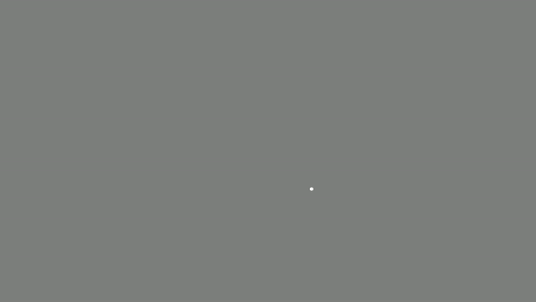

*MoG v tme*


*KNN v tme*

Pre prvé video je výsledok takmer identický, no pre video v tme je metóda **MoG** lepšia, keďže sa na maske nachádza daný objekt  po celý čas.

#### Detekcia objektu
Na detekovanie objektu sme najskôr vytvorili kontúry vo vytvorenej maske, z ktorých sme vybrali len tú najväčšiu a pre ňu sme následne vytvorili bounding box.  Na získanie súradníc bounding boxu sme si vytvorili vlastnú funkciu `get_bounding_box()`.

```py
def get_bounding_box(mask, method=''):
   box = None
	 if method == 'contours':
       contours, _ = cv2.findContours(mask, cv2.RETR_EXTERNAL, cv2.CHAIN_APPROX_SIMPLE)
       if len(contours) > 0:
           largest_contour = max(contours, key=cv2.contourArea)
           x, y, w, h = cv2.boundingRect(largest_contour)
           box = {'x': x, 'y': y, 'w': w, 'h': h} 
   return box
```

```py
# draw bounding boxes
box_mog = get_bounding_box(mask_mog, method='contours')
if box_mog != None:
    frame = cv2.rectangle(
        frame, (box_mog['x'], box_mog['y']), (box_mog['x'] + box_mog['w'], box_mog['y'] + box_mog['h']), (0, 255, 0), 2
    )

box_knn = get_bounding_box(mask_knn, method='contours')
if box_knn != None:
    frame = cv2.rectangle(
        frame, (box_knn['x'], box_knn['y']), (box_knn['x'] + box_knn['w'], box_knn['y'] + box_knn['h']), (0, 0, 255), 2
    )
```

Zelený bounding box predstavuje **MoG** a červený **KNN**.


*Porovnanie bounding boxov pre MoG a KNN*


*Porovnanie bounding boxov pre MoG a KNN v tme*

#### Running average
Ako ďalšie sme taktiež vyskúšali použiť metódu **running average** na segmentáciu pohybujúceho objektu. Táto metóda spočíva v tom, že počíta váhovaný priemer z posledných framov. Na začiatku sme si premennú, ktorá reprezentovala tento priemer, inicializovali na hodnotu prvého framu v grayscale. 

```py
running_avg = np.float32(cv2.cvtColor(frame, cv2.COLOR_BGR2GRAY))
```

Následne sme ju už aktualizovali pomocou funkcie `accumulateWeighted()`. 

```py
# update the running average
cv2.accumulateWeighted(gray, running_avg, alpha=0.4)
```

Na to aby sme získali masku pohybujúceho objektu sme vypočítali rozdiel medzi aktuálnym framom a týmto priemerom, výsledok sme thresholdovali a ďalej upravili pomocou morfologických operácií.

```py
# create binary mask from the computed difference
_, mask = cv2.threshold(diff, 10, 255, cv2.THRESH_BINARY)
mask = cv2.morphologyEx(mask, cv2.MORPH_CLOSE, kernel)
mask = cv2.dilate(mask, kernel, iterations=2)
```

Na koniec sme ešte pre takto získanú masku vykreslili okolo objektu bounding box, pomocou rovnakej metódy ako v predchádzajúcich častiach.

```py
# draw bounding box
box = get_bounding_box(mask, method='contours')
if box != None:
    frame = cv2.rectangle(frame, (box['x'], box['y']), (box['x'] + box['w'], box['y'] + box['h']), (0, 255, 0), 2)
```


*Bounding box pre metódu running average*

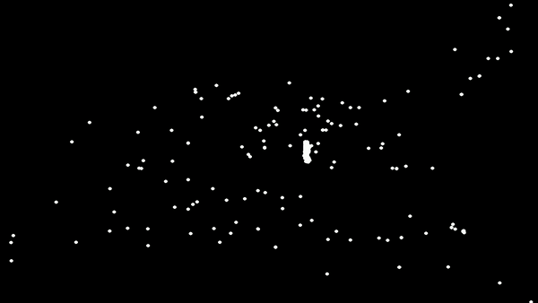

*Vytvorená maska pre metódu running average*


*Bounding box pre metódu running average v tme*

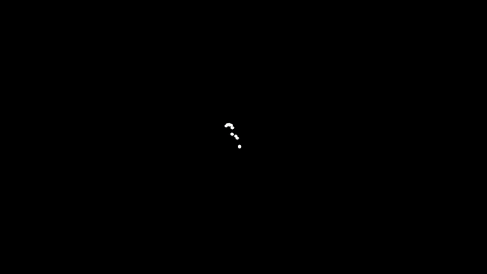

*Vytvorená maska pre metódu running average v tme*

Podobne ako v predchádzajúcich experimentoch s metódou **KNN**, aj v tomto prípade boli výsledky veľmi dobré na prvom videu, no na videu v tme sa nám nepodarilo objekt dostatočne vysegmentovať.

### Vylepšenie počiatočnej metódy pre sparse flow
Ako ďalšie sme sa rozhodli vylepšiť metódu na počítanie sparse flow pomocou masky vytvorenej s **MoG**. Z veľkej časti sú tieto dve metódy rovnaké a jediný rozdiel je v metóde pre získavanie klúčových bodov, v ktorej sme špecifikovali vytvorenú masku.

```py
kp0 = cv2.goodFeaturesToTrack(old_gray, mask=mask_mog, qualityLevel=0.01, maxCorners=300, minDistance=10)
```

V tomto prípade sme už mohli vytvárať kvalitnejšie a rovnako aj menší počet bodov pri znovu vytváraní bodov za behu programu. 

```py
# generate new keypoints 
if len(kp0) < 10:
    new_kp = cv2.goodFeaturesToTrack(gray, mask=mask_mog, qualityLevel=0.4, maxCorners=30, minDistance=100)
    kp0 = np.concatenate((kp0, new_kp), axis=0)
```


*Sparse flow s použitím masky*


*Sparse flow s použitím masky v tme*

Ako môžeme vidieť na ukážkach vyššie metóda sa po špecifikovaní masky zlepšila, hlavne pri videu v noci.

### Dense optical flow
Ďalej sme taktiež vyskúšali identifikovať viaceré pohybujúce objekty pomocou **dense optical flow**, ktorý sme vypočítali s metódou `calcOpticalFlowFarneback()`, do ktorej okrem ostatných parametrov vstupuje taktiež predchádzajúci a súčastný frame, pre ktoré metóda vráti pole s vektormi posunutia (**u** - horizontálne, **v** - vertikálne) v aktuálnom frame-e vzhľadom na jeho zodpovedajúcu polohu v predchádzajúcom frame-e.

```py
# calculate optical flow
flow = cv2.calcOpticalFlowFarneback(old_gray, gray, None, pyr_scale=0.5, levels=4, winsize=17, iterations=3, poly_n=7, poly_sigma=1.7, flags=0)
```

Hodnoty parametrov do funkcie sme zistili experimentálne podľa našich vstupných dát. 

Podľa týchto vektorov si môžeme vypočítať velkosť vektorov (rýchlosť pohybu) a taktiež aj ich smer.

```py
# get magnitute (speed of the motion) and angle (direction of the motion)
magnitude, angle = cv2.cartToPolar(flow[:,:,0], flow[:,:,1])
```

Velkosť vektorov môžeme použiť na vytvorenie masky pre pohybujúce sa objekty pomocou thresholdingu, ktorý použijeme na odstránenie 'malých' vektorov, teda objektov, ktoré sa nepohybujú. Vytvorenú masku ešte môžeme upraviť pomocou morfologických operácií.

```py
# create binary mask by thresholding the magnitude
_, mask = cv2.threshold(magnitude, threshold, 255, cv2.THRESH_BINARY)
mask = cv2.morphologyEx(mask, cv2.MORPH_CLOSE, kernel)
```

Na detekovanie pohybujúcich sa obrázkov použijeme bounding box-y, ktoré vykreslíme na základe kontúr zo získanej masky, ktoré si ešte vyfiltrujeme podľa ich plochy.

```py
# get suitable contours from the mask
contours, _ = cv2.findContours(mask, cv2.RETR_EXTERNAL, cv2.CHAIN_APPROX_SIMPLE)
filtered_contours = []
for contour in contours:
    if cv2.contourArea(contour) > 1000:
        x, y, w, h = cv2.boundingRect(contour)
        filtered_contours.append(contour)

# draw bounding boxes around the contours
for contour in filtered_contours:
    x, y, w, h = cv2.boundingRect(contour)
    cv2.rectangle(frame, (x, y), (x + w, y + h), (0, 255, 0), 2)
```

Optical flow sme vizualizovali podľa farieb, kde smer zodpovedá odtienu a rýchlosť hodnote farieb. Takto získané farbné reprezentácie sme ešte následne spojili s pôvodnym framom.

```py
# create visualization
# [OpenCV: Optical Flow](https://docs.opencv.org/4.x/d4/dee/tutorial_optical_flow.html)
hsv[:,:,0] = angle * 180 / np.pi / 2 
hsv[:,:,1] = 255
hsv[:,:,2] = cv2.normalize(magnitude, None, 0, 255, cv2.NORM_MINMAX)
visualization = cv2.cvtColor(hsv, cv2.COLOR_HSV2BGR)

# combine or blend the visualized optical flow and the original frame
combined = cv2.addWeighted(frame, 1, visualization, 1.5, 0)
```


*Bounding boxy pre pohybujúce sa objekty na prvom videu*


*Maska pre prvé video*


*Vizualizovaný optical flow pre prvé video*

- - - -


*Bounding boxy pre pohybujúce sa objekty na druhom videu*

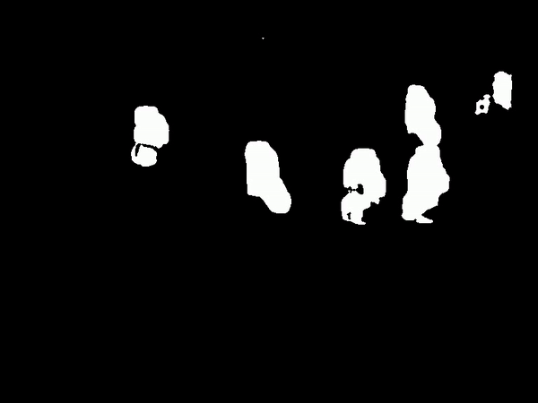

*Maska pre druhé video*


*Vizualizovaný optical flow pre druhé video*


## Segmentácia
### GrabCut
V tejto časti sme vytvorili interaktívny program, ktorý umožnuje používateľovi segmentovať daný obrázok metódou **GrabCut**. Program taktiež umožňuje ďalej upraviť získanú segmentáciu špecifikovaním pixelov prislúchajúcich pozadiu alebo danému objektu. Zdrojový kód k tejto časti je v `grab_cut.py`.

Na začiatku musí používatel definovať oblasť, v ktorej sa daný objekt nachádza. Túto oblasť urči pomocou dvoch bodov, ktoré pridá kliknutím pravého a ľavého tlačidla na myši. 

```py
# left mouse button events
if event == cv2.EVENT_LBUTTONDOWN:
    if select_rectangle:
        point1 = (x, y)
        img = cv2.circle(img, point1, 4, (0, 0, 255), -1)
    elif draw_scribble:
        drawing_left = True
        print('Drawing foreground')

elif event == cv2.EVENT_LBUTTONUP:
    drawing_left = False
    
# right mouse button events
elif event == cv2.EVENT_RBUTTONDOWN:
    if select_rectangle:
        point2 = (x, y)
        img = cv2.circle(img, point2, 4, (255, 0, 0), -1)
    elif draw_scribble:
        drawing_right = True
        print('Drawing background')

elif event == cv2.EVENT_RBUTTONUP:
    drawing_right = False
```

Po zadaní obidvoch bodov sa vytvorí obdĺžnik.

```py
# when both points are set, draw a rectangle connecting them
if point1 and point2 and select_rectangle:
    rect = (min(point1[0], point2[0]), min(point1[1], point2[1]), abs(point1[0] - point2[0]), abs(point1[1] - point2[1]))
    cv2.rectangle(img, (rect[0], rect[1]), (rect[0] + rect[2], rect[1] + rect[3]), (0, 255, 0), 2)
    select_rectangle = False
    draw_scribble = True
```

Používateľ má taktiež možnosť jednoduchých anotácií, kde pri držaní ľavého tlačidla na myši špecifikuje oblasť, ktorá obsahuje daný objekt a pri držaní pravého tlačidla zas pozadie. Kreslenie je možné len po špecifikovaní obdĺžnika alebo po stlačení tlačidla `t` na klávesnici. Používateľ má taktiež možnosť resetnúť program pomocou tlačidla `r`.

```py
 # mouse move events 
elif event == cv2.EVENT_MOUSEMOVE:
    if drawing_left and draw_scribble:
        cv2.circle(mask, (x, y), 4, cv2.GC_FGD, -1)
        cv2.circle(img, (x, y), 4, (0, 0, 255), -1)

    elif drawing_right and draw_scribble:
        cv2.circle(mask, (x, y), 4, cv2.GC_BGD, -1)
        cv2.circle(img, (x, y), 4, (255, 0, 0), -1)
```

Samotná metóda na vytváranie segmentácií je pomerne jednoduchá. Pre vytvorenie segmentácie je potrebné stlačiť tlačidlo `s`.

```py
# segmentation with grab cut
# https://docs.opencv.org/3.4/d8/d83/tutorial_py_grabcut.html
def segment(img, mask, rect):
    bgd_model = np.zeros((1, 65), np.float64)
    fgd_model = np.zeros((1, 65), np.float64)
    
    # use the mask when it contains scribbles
    if len(np.unique(mask)) > 1:
        print('Segmenting using mask')
        mode = cv2.GC_INIT_WITH_MASK
    else:
        print('Segmenting using rectangle')
        mode = cv2.GC_INIT_WITH_RECT
    mask, _, _ = cv2.grabCut(img, mask, rect, bgd_model, fgd_model, 5, mode)
    
    # mask include values from 0 to 4, (background, foreground, possible background and possible forground)
    # change all background (0, 2) pixels to 0 and all foreground (1, 3) to 1
    tmp_mask = np.where((mask==0) | (mask==2), 0, 255).astype('uint8')
    img = cv2.bitwise_and(img, img, mask=tmp_mask)

    cv2.imshow("seg", img)
    cv2.imshow("mask", tmp_mask)

    return img, mask
```

Na začiatku sa vytvoria pomocné premenné `bgd_model` a `fgd_model`, ktoré používa metóda `grabCut()`. Ďalej sa zvolí mód vytvárania segmentácie, ktorý môže byť buď podľa definovaného obdĺžnika alebo masky (ktorá obsahuje hodnoty od 0 po 4). Následne sa už len zavolá metóda `grabCut()` so špecifikovanými parametrami. Táto metóda vracia vytvorenú masku, ktorú zbinarizujeme, teda jej zmeníme hodnoty 0 a 2 (predstavujúce pozadie) na 0 a hodnoty 1 a 3 (predstavujúce objekt) na 1. Na koniec už len vytvoríme finálnu segmentáciu spojením pôvodného obrázku a masky.


*Ukážka segmentovania pomocou GrabCut*


*Ďalšia ukážka segmentovania pomocou GrabCut*

### Super pixely
V tejto časti sme sa pokúsili vytvoriť segmentácie s použitím superpixelov a metódy **SLIC**. Superpixely sme vytvorili pomocou metódy `cv2.ximgproc.createSuperpixelSLIC()` s použitím algoritmu `SLICO`. 

```py
slic = cv2.ximgproc.createSuperpixelSLIC(gray, cv2.ximgproc.SLICO, region_size=30, ruler=20)
slic.iterate(20)
```

Následne sme vizualizovali okraje vzniknutých superpixelov.

```py
mask = slic.getLabelContourMask(thick_line=True)
contour_img = copy.deepcopy(img)
contour_img[mask==255] = (0, 0, 255)
```


Ďalej sme sa rozhodli vizualizovať priemernú farbu superpixelov. Pri tejto časti sme si najskôr zistili akému superpixelu prislúchajú jednotlivé pixely v obrázku. Následne sme si vytvorili pole, ktoré uchováva priemerné farby pre jednotlivé superpixely. Toto pole sme postupne napĺňali v cykle, kde sme si najskôr pomocou masky vybrali práve tie pixely, ktoré patria pod daný superpixel a potom jednoducho pomocou metódy `mean()` vypočítali ich priemernú farbu.

```py
# get corresponding labels for each pixel
labels = slic.getLabels()
num_labels = len(np.unique(labels))

# compute mean colour for each label (group of pixels)
mean_colours = np.zeros((num_labels, 3), dtype=np.uint8)
for label in np.unique(labels):
    tmp_mask = (labels == label).astype(np.uint8)
    mean_colours[label] = cv2.mean(img, mask=tmp_mask)[:3]
```

Na koniec sme už len priradili priemerné farby príslušným superpixelom.

```py
# create a colour image by assigning mean colours to labels
mean_colour_img = mean_colours[labels]
```

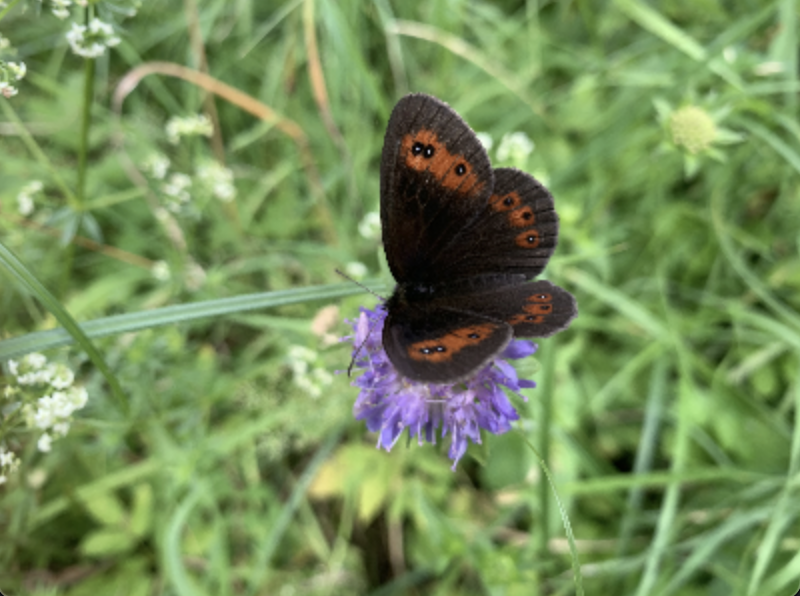

*Pôvodný obrázok motýla*

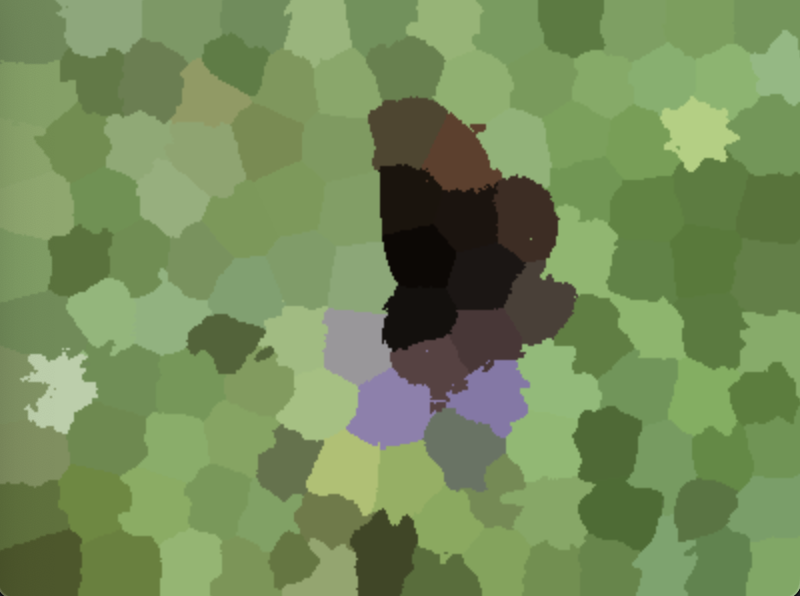

*Superpixely pre obrázok motýla*

Rovnakú metódu sme vyskúšali aj na ďalších obrázkoch.

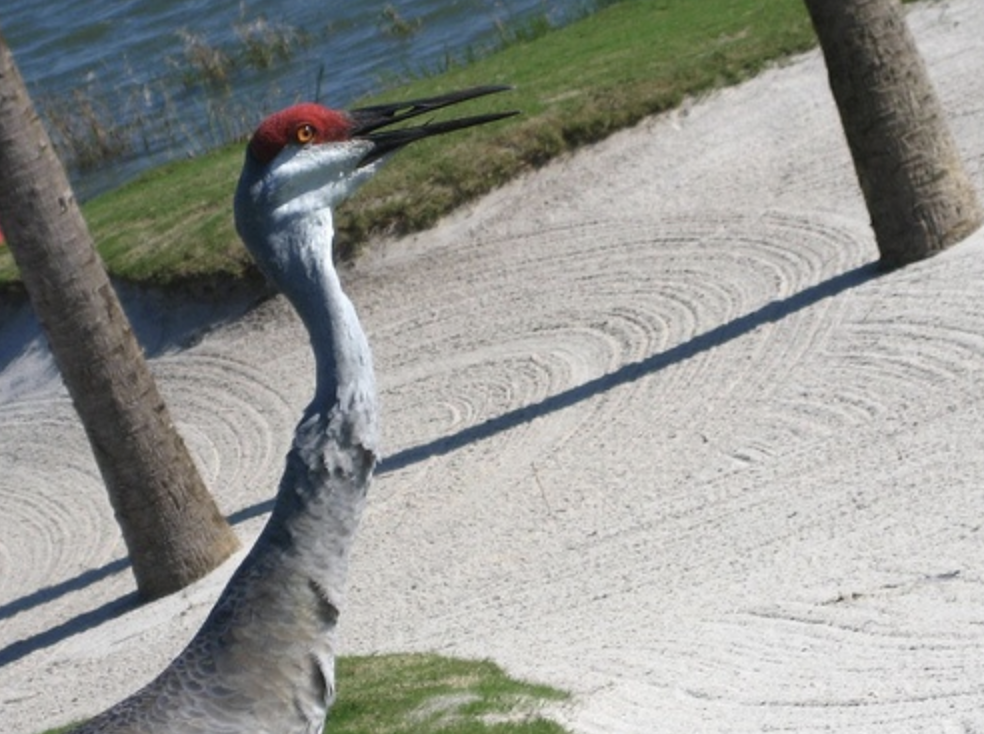

*Pôvodný obrázok vtáka*


*Superpixely pre obrázok vtáka*

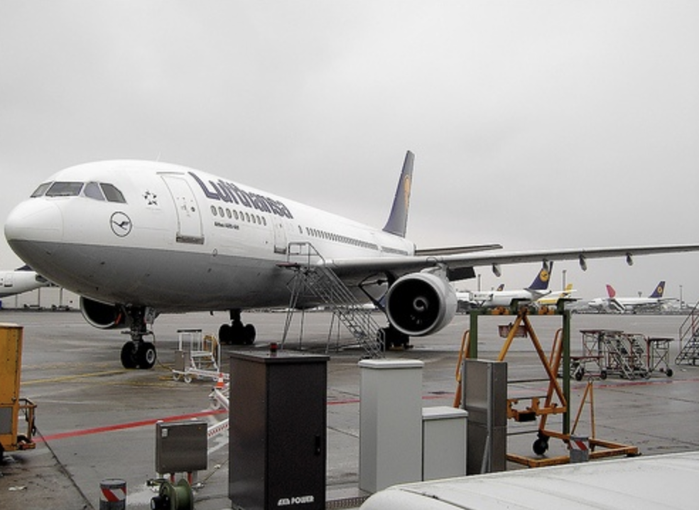

*Pôvodný obrázok lietadla*

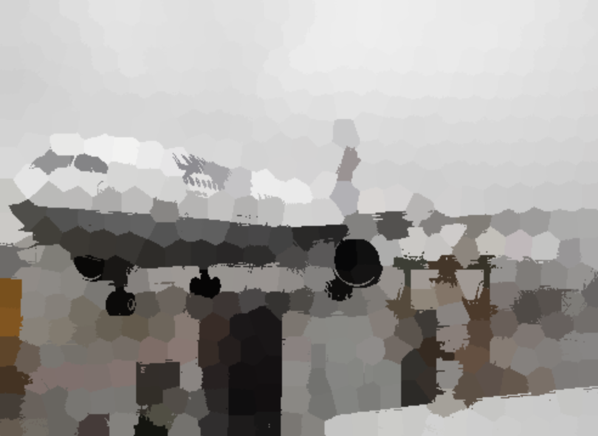

*Superpixely pre obrázok lietadla*

#### Použitie iných algoritmov
Ako ďalšie sme ešte vyskúšali použiť algoritmy `SLIC` a `MSLIC`.

**Obrázok motýla**


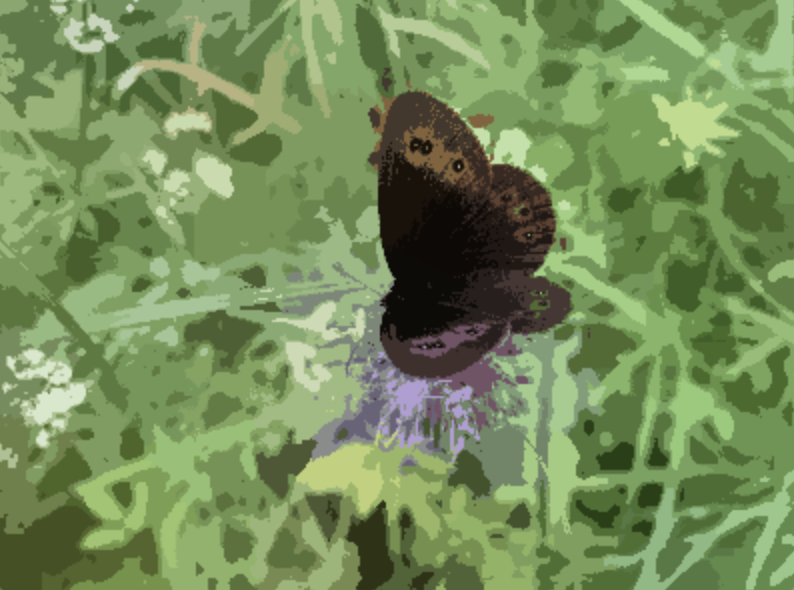

*Algoritmus SLIC pre obrázok motýla*

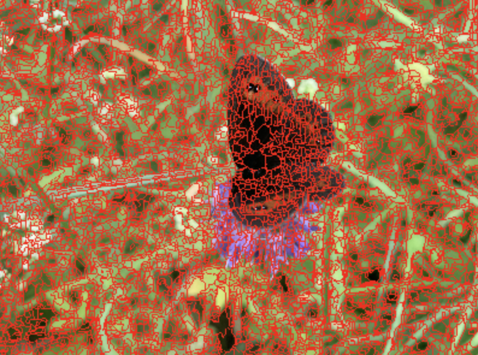
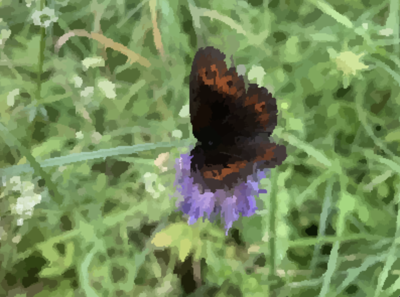

*Algoritmus MSLIC pre obrázok motýla*

**Obrázok vtáka**

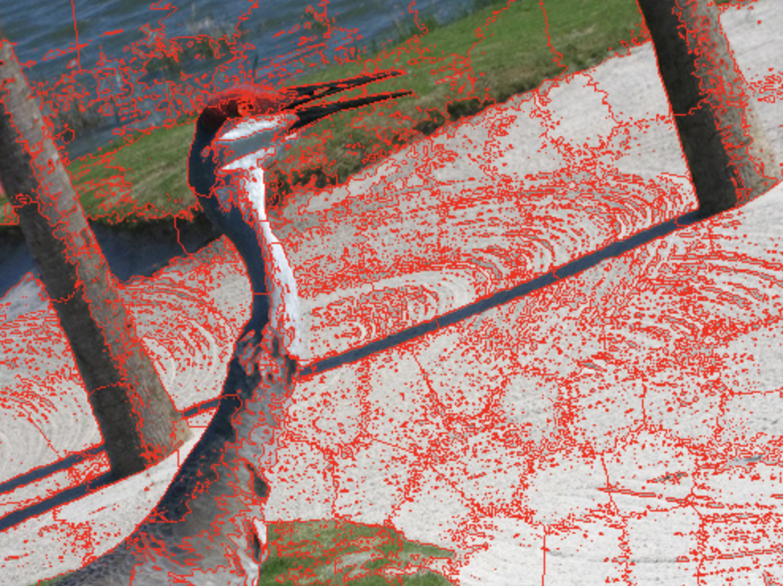
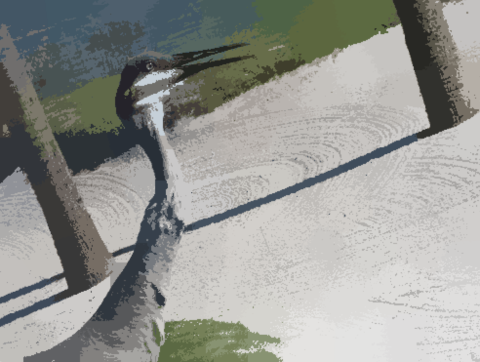

*Algoritmus SLIC pre obrázok vtáka*

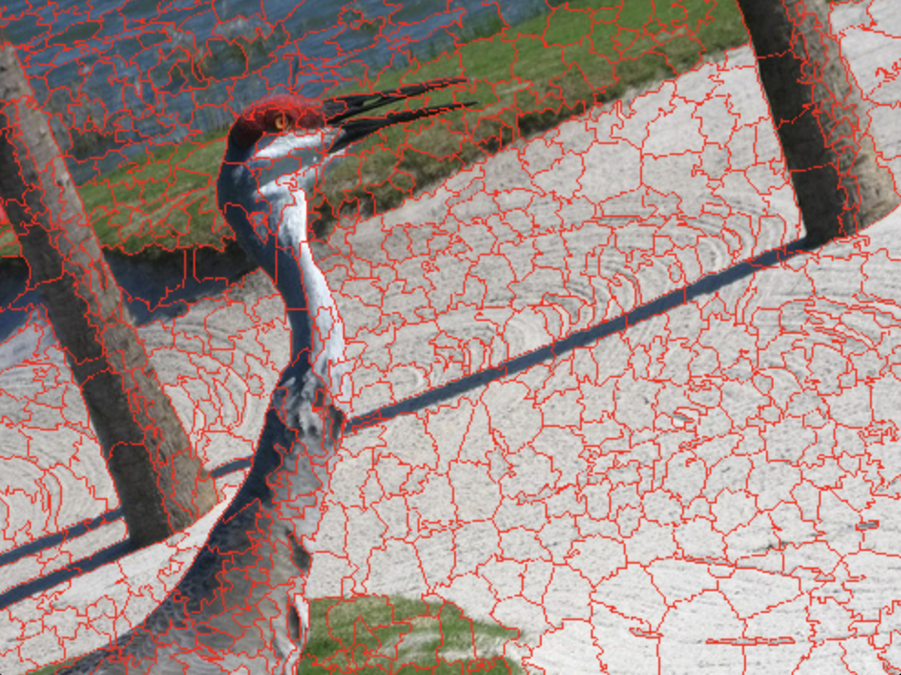
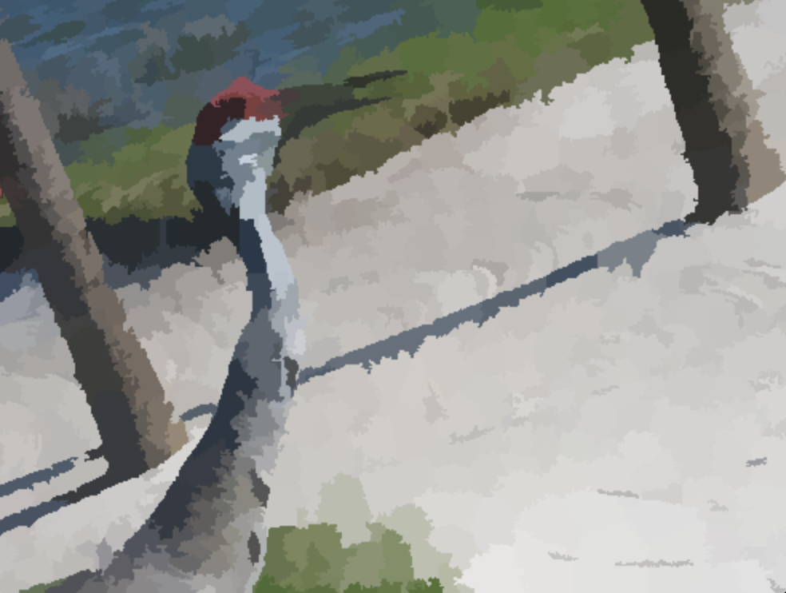

*Algoritmus MSLIC pre obrázok vtáka*

**Obrázok lietadla**

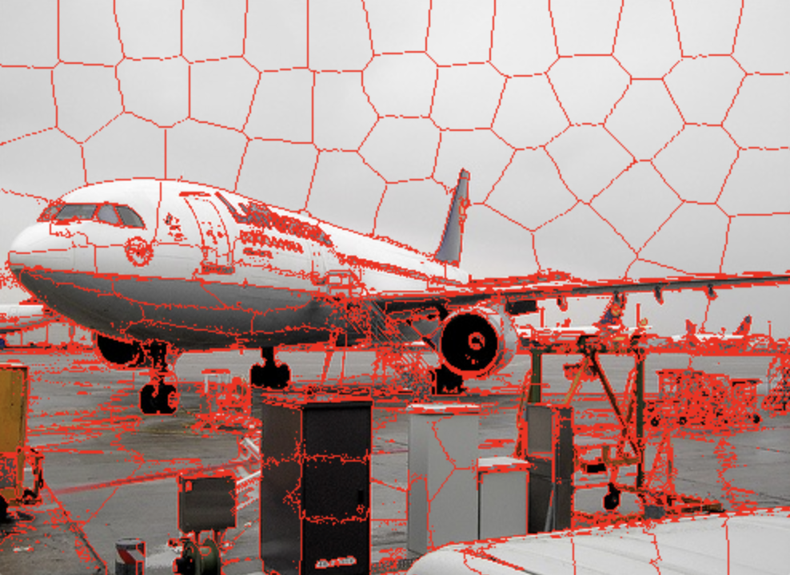
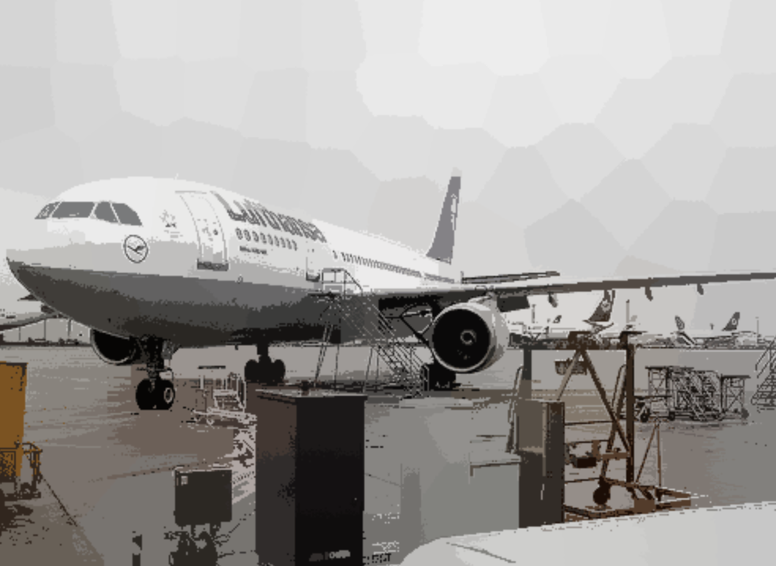

*Algoritmus SLIC pre obrázok lietadla*

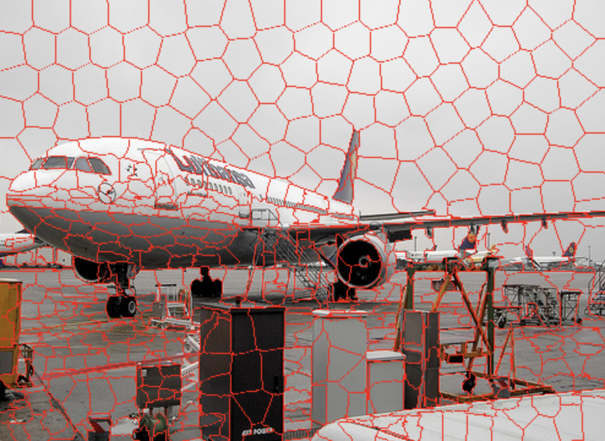
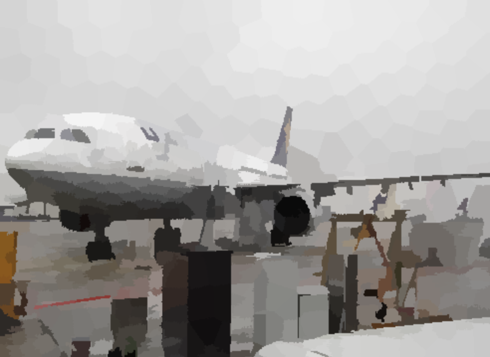

*Algoritmus MSLIC pre obrázok lietadla*