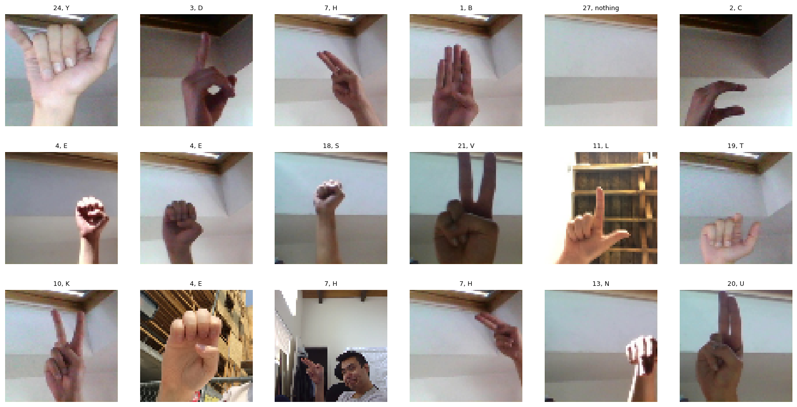
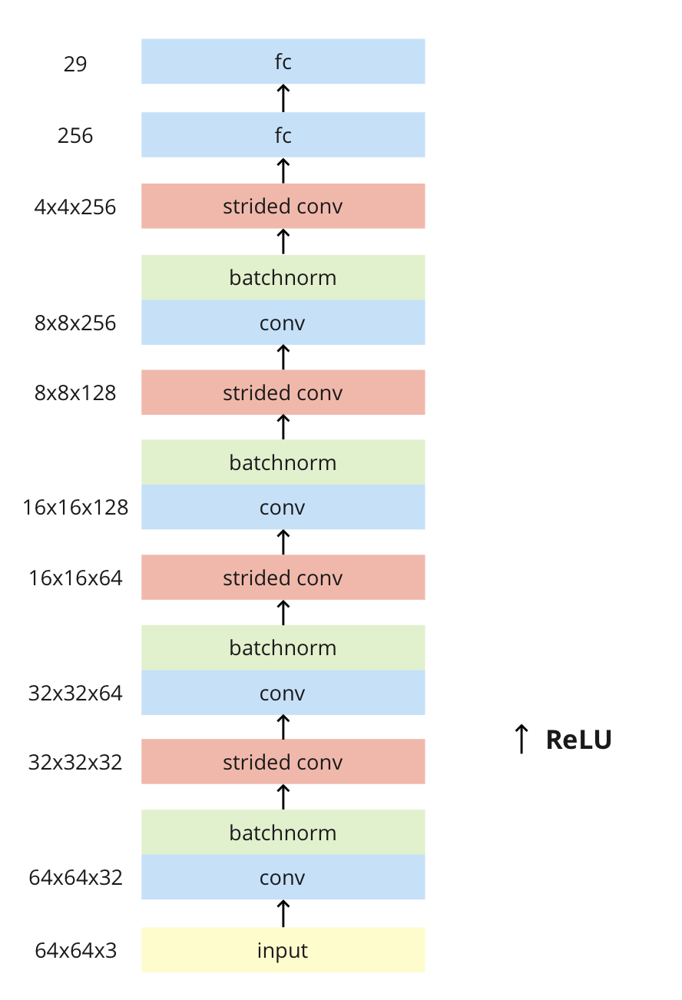
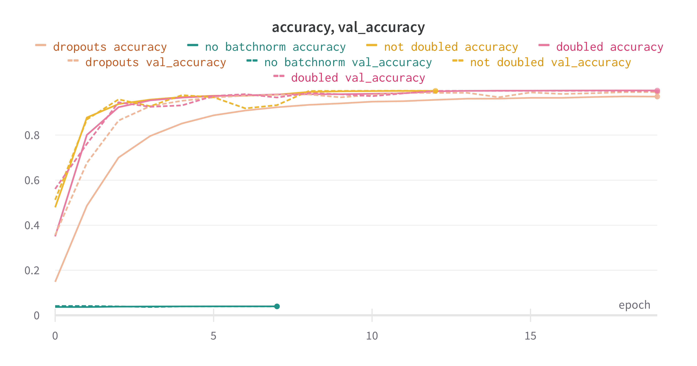
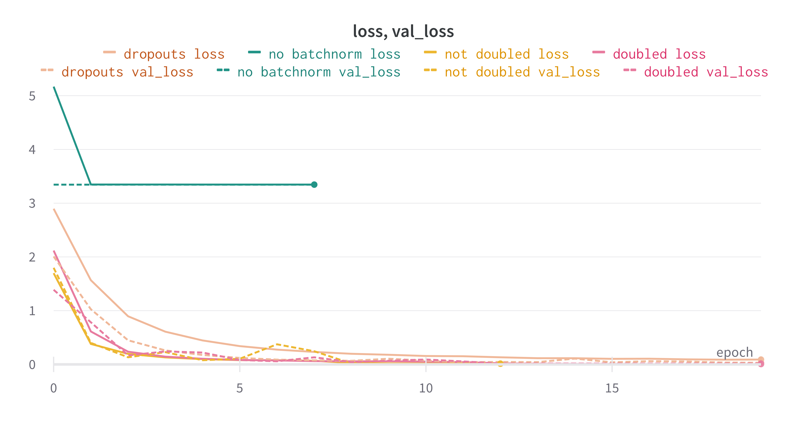
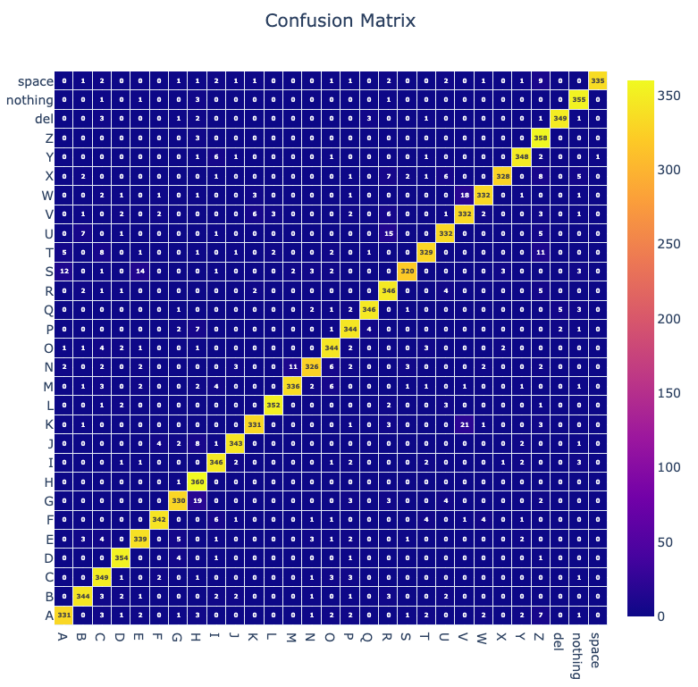
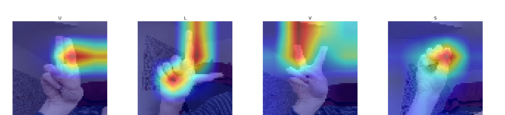

# assignment-4

## Classification of images
In this assignment, we tried to use neural networks to **classify images of hands that showed American Sign Language characters**. Our solution is implemented in Python using the Pytorch library.

### Dataset
The dataset contains `29` classes (letters of the alphabet + special characters) and a total of 90 162 images, which we divided into training (72 129, i.e. 80% of the original dataset), validation (9 016, i.e. 10% of the original dataset) and test ( 9 016, i.e. 10% of the original dataset). Almost all classes were equally represented in the dataset (each class had around 3 400 images except J and Z which had 1 800).
The dataset used is freely available at [ASL Dataset Mix (Static) | Kaggle](https://www.kaggle.com/datasets/kirlelea/asl-dataset-mix-static).



*Dataset overview*

As part of preprocessing, we first reduced the input data to `64x64` and then trimmed it. Next, we scaled the pixel values ​​to range from `0` to `1`. In our case, there was no need to make augmentations, as our dataset was quite extensive.

### Model
The architecture of our model consists of 4 convolutional blocks. Each block consists of one convolutional layer, followed by batch normalization and downsampling operation, which in our case is represented by convolution with `stride=2`. The convolutional blocks are followed by 2 fully connected layers, which serve to classify the input image itself.



*Model architecture*

In total, our model has 2 230 013 trainable parameters, of which 1 056 285 are in the classifier (fully connected layers).

### Training
We trained the model with batchsize `256`, after max `20` epochs, where we used early stopping in case the model stopped improving (validation loss did not decrease). As a loss function we used `Cross entropy` and as an optimizer we used `Adam` with an initial learning rate of `0.01`, which we reduced in case the model got stuck / stopped improving.



*Progress of training from wandb - Accuracy*



*Progress of training from wandb - Loss*

During training, we tried several variants of our architecture:
- `not doubled` - each block contained only one convolution + strided convolution (architecture from the picture)
- `doubled` - use of two convolutional layers in the last block
- `dropouts` - adding a dropout with a probability of `0.3` between individual blocks
- `no batchnorm` - without using batch normalization.

We thought the architecture from the `not doubled` run was the best. This version learned the fastest and at the same time achieved the best results. From the graphs, we can also notice that the model without batch normalization had significant learning problems.

### Evaluation
We tested our model on the test dataset (high quality data that the model has not seen before), where our model achieved good results. The average loss was `0.29164` and the average accuracy was `0.94387`.



*Confusion matrix for test data*

We also visualized the activation maps from the last convolutional block. We used the [pytorch-gradcam](https://jacobgil.github.io/pytorch-gradcam-book/introduction.html) library for this visualization.



*Ukážky aktivačných máp*

### Testing on own data
In order to make sure of the applicability of our model, we also tested it on our own data.
In this case, we read the video from the camera frame by frame, where when the person (hand) stopped moving, the recording stopped and the last frame was adjusted and sent to the model that classified it.
We detected the movement on the video by using the difference between the current and the previous frame, which we thresholded and counted all non-zero pixels.
When the number of these pixels was `<` as some threshold value, the value of the variable that counted the number of frames without sufficient movement was increased, where if this variable reached the value of `5`, the video stopped.

```py
diff = cv2.absdiff(last_frame, gray)
_, motion_mask = cv2.threshold(diff, 30, 255, cv2.THRESH_BINARY)
motion_pixel_count = cv2.countNonZero(motion_mask)

if motion_pixel_count < motion_threshold:
    motionless_frames += 1
else:
    last_frame = gray
    motionless_frames = 0

if motionless_frames == 5:
    img = select_rectangle(frame)
    img = cv2.cvtColor(img, cv2.COLOR_BGR2RGB)
    img = preprocess_img(img)
    y_pred = model(img.to(device))
```

Since our training dataset contained mostly images with only the hands visible, the model sometimes had problems with frames which also included, for example a face. That's why we added the option to denote the hand with a rectangle. An improvement to this method could be to create this rectangle automatically, e.g. using segmentation.


*Example of classification, the model correctly classified character A*


*Sample of classification, the model correctly classified the character J*


*Example of classification, the model correctly classified the character Z*


*Sample classification, the model incorrectly classified the character H*
