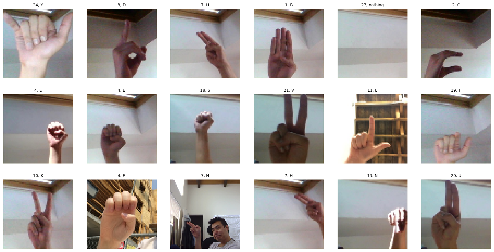
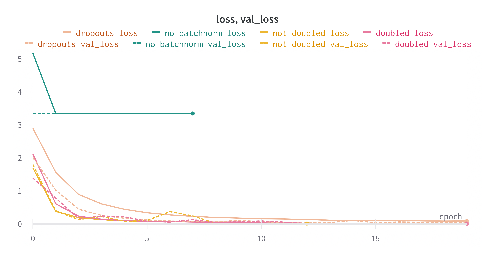
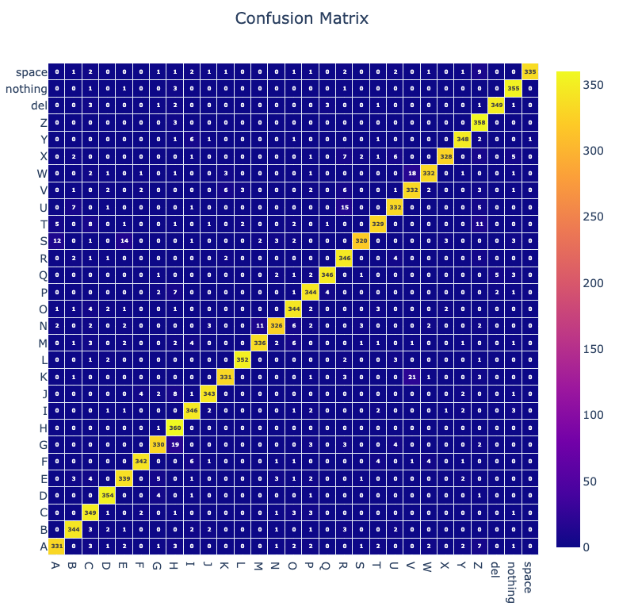

# assignment-4

meno: Jakub Povinec

[link na video](https://drive.google.com/file/d/1B65TDJy1lRokc54ABbIBj7mRwi3pVD5d/view?usp=sharing)

- - - -

## Klasifikácia obrázkov
V tomto zadaní sme sa pomocou neurónových sietí pokúsili **klasifikovať obrázky rúk, ktoré znázorňovali znaky americkej posunkovej reči**. Naše riešenie je implementované v jazyku Python s použitím knižnice Pytorch.

### Dataset
Dataset obsahuje `29` tried (písmená abecedy + špeciálne znaky) a celkovo 90 162 obrázkov, ktoré sme si rozdelili na trénovacie (72 129, teda 80% pôvodného datasetu), validačné (9 016, teda 10% pôvodného datasetu) a testovacie (9 016, teda 10% pôvodného datasetu). Takmer všetky triedy boli v datasete zastúpené rovnomerne (každá trieda mala okolo 3400 obrázkov okrem J a Z, ktoré mali 1800). 
Použitý dataset je voľne dostupný na [ASL Dataset Mix (Static) | Kaggle](https://www.kaggle.com/datasets/kirlelea/asl-dataset-mix-static).



*Prehľad datasetu*

V  rámci predspracovania sme vstupné datá najskôr zmenšili na `64x64` a následne orezali. Ďalej sme zoškálovali hodnoty pixelov na rozsah od `0` po `1`. V našom prípade nebolo potrebné robiť augmentácie, keďže náš dataset bol pomerne rozsiahly.

### Model
Architektúra nášho modelu sa skladá zo 4 konvolučných blokov. Každý blok pozostáva z jednej konvolučnej vrstvy, za ktorou nasleduje batch normalizácia a downsampling operácia, ktorú v našom prípade reprezentuje konvolúcia so `stride=2`. Za konvolučnými blokmi nasledujú 2 plne prepojené vrstvy, ktoré slúžia na samotné klasifikovanie vstupného obrázku. 


*Architektúra modelu*

Celkovo má náš model 2 230 013 trénovateľných parametrov, z ktorých sa 1 056 285 nachádza v klasifikátore (plne prepojených vrstvách).

### Tréning
Model sme trénovali s batchsize `256`, po max `20` epoch, kde sme využili early stopping v prípade, keď sa model prestal zlepšovať (nezmenšoval sa validačný loss). Ako loss funkciu sme použili `Cross entropy` a ako optimizer sme použili `Adam` so začiatočným learning rate `0.01`, ktorý sme ale zmenšovali v prípade ak sa model zasekol / prestal zlepšovať. 


*Priebeh tréningu z wandb - Accuracy*



*Priebeh tréningu z wandb - Loss*

Pri tréningu sme skúšali viaceré varianty našej architektúry:
- `not doubled` - každý blok obsahoval len jednu konvolúciu + strided konvolúciu (architektúra z obrázka)
- `doubled` - použitie dvoch konvolučných vrstiev v poslednom bloku
- `dropouts` - pridanie dropoutu s pravdepodobnosťou `0.3` medzi jednotlivé bloky
- `no batchnorm` - bez požitia batch normalizácie.

Ako najlepšia sa nám zdala práve architektúra z behu `not doubled`, ktorá sa učila najrýchlejšie a zároveň dosiahla najlepšie výsledky. Z grafov si môžeme taktiež všimnúť, že model bez batch normalizácie mal pri učení výrazné problémy.

### Evaluácia
Náš model sme otestovali na testovacích dátach, ktoré model predtým nevidel. Náš model dosiahol v testovaní veľmi dobré výsledky. Priemerný loss bol `0.29164` a priemerná accuracy `0.94387`. 



*Confusion matrix pre testovacie dáta*

Taktiež sme si vizualizovali aktivačné mapy z posledného konvolučného bloku. Na túto vizualizáciu sme použili knižnicu [pytorch-gradcam](https://jacobgil.github.io/pytorch-gradcam-book/introduction.html).


*Ukážky aktivačných máp*

### Testovanie na vlastných dátach
Aby sme sa presvedčili o použitelnosti nášho modelu, otestovali sme ho taktiež aj na vlastných dátach. V tomto prípade sme čítali video z kamery po jednotlivých framoch, kde v prípade, keď sa človek (ruka) prestala na videu pohybovať snímanie sa zastavilo a posledný frame sa upravil a poslal do modelu, ktorý ho klasifikoval. Pohyb na videu sme zisťovali pomocou rozdielu súčastného a predchádzajúceho framu, ktorý sme thresholdovali a spočítali na ňom nenulové pixely. V prípade, ak bol počet týchto pixelov `<` ako nejaký threshold, zvýšila sa hodnota premennej, ktorá počítala počet framov bez dostatočného pohybu, kde ak táto premenná dosiahla hodnotu `5`, video sa zastavilo.

```py
diff = cv2.absdiff(last_frame, gray)
_, motion_mask = cv2.threshold(diff, 30, 255, cv2.THRESH_BINARY)
motion_pixel_count = cv2.countNonZero(motion_mask)

if motion_pixel_count < motion_threshold:
    motionless_frames += 1
else:
    last_frame = gray
    motionless_frames = 0

if motionless_frames == 5:
    img = select_rectangle(frame)
    img = cv2.cvtColor(img, cv2.COLOR_BGR2RGB)
    img = preprocess_img(img)
    y_pred = model(img.to(device))
```

Keďže náš trénovací dataset obsahoval vo väčšine prípadov len ruky, model mal v niektorých prípadoch problém správne klasifikovať framy, v ktorých sa nachádzala napr. aj tvár. Preto sme pridali možnosť ohraničiť ruku obdĺžnikom. Vylepšením tejto metódy by mohlo byť vytvorenie tohto obdĺžnika automaticky, napr. pomocou segmentácie. 


*Ukážka klasifikácie, model správne klasifikoval znak A*


*Ukážka klasifikácie, model správne klasifikoval znak J*


*Ukážka klasifikácie, model správne klasifikoval znak Z*


*Ukážka klasifikácie, model nesprávne klasifikoval znak H*